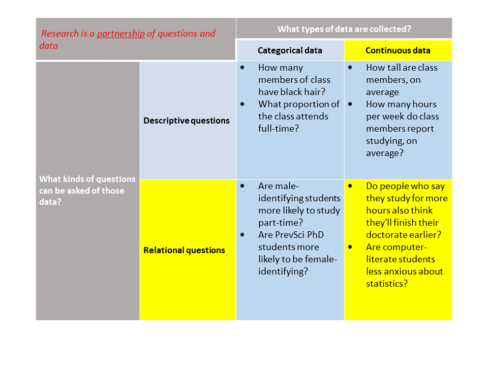

```{R, setup, include = F}
library(pacman)
p_load(here, tidyverse, xaringan, knitr, kableExtra, xaringanthemer, faux)

i_am("slides/EDUC641_15_regression.rmd")


red_pink <- "#e64173"
turquoise = "#20B2AA"
orange = "#FFA500"
red = "#fb6107"
blue = "#3b3b9a"
green = "#8bb174"
grey_light = "grey70"
grey_mid = "grey50"
grey_dark = "grey20"
purple = "#6A5ACD"
slate = "#314f4f"

extra_css <- list(
  ".red"   = list(color = "red"),
  ".blue"  =list(color = "blue"),
  ".red-pink" = list(color= "red_pink"),
  ".grey-light" = list(color= "grey_light"),
  ".purple" = list(color = "purple"),
  ".small" = list("font-size" = "90%"))

write_extra_css(css = extra_css, outfile = "my_custom.css")


# Knitr options
opts_chunk$set(
  comment = "#>",
  fig.align = "center",
  fig.height = 6.75,
  fig.width = 10.5,
  warning = F,
  message = F
)
opts_chunk$set(dev = "svg")
options(device = function(file, width, height) {
  svg(tempfile(), width = width, height = height)
})
options(knitr.table.format = "html")

```
# Roadmap

```{r, out.width = "90%", echo=F}
  
```

                                                       
---
# Goals of the unit

- Describe relationships between quantitative data that are continuous
- Visualize and substantively describe the relationship between two continuous variables 
- Describe and interpret a fitted bivariate regression line
- Describe and interpret components of a fitted bivariate linear regression model

.grey-light[
- Visualize and substantively interpret residuals resulting from a bivariate regression model
- Conduct a statistical inference test of the slope and intercept of a bivariate regression model
]

- Write R scripts to conduct these analyses


---
# Reminder of motivating question

#### We learned a lot about the distribution of life expectancy in countries, now we are turning to thinking about relationships between life expectancy and other variables. In particular:

#### .blue[Do individuals living in countries with more total years of attendance in school experience, on average, higher life expectancy?]

#### In other words, we are asking whether the variables *SCHOOLING* and *LIFE_EXPECTANCY* are related.

---
# Materials

### 1. Life expectancy data (in file called life_expectancy.csv)
### 2. Codebook describing the contents of said data
### 3. R script to conduct the data analytic tasks of the unit
---
class: middle, inverse

# Our continuous relationship 
### (and some data-cleaning)


---
# Reading our data in
```{r, echo = T}
who <- read.csv(here("data/life_expectancy.csv")) %>%
  # first making variable names take a common format
  janitor::clean_names() %>% 
  # filtering to focus only on 2015
  filter(year == 2015) %>%
  # selecting only the variables we need
  select(country, status, schooling, life_expectancy) %>% 
  # renaming one of the variables that is really misnamed
  rename(region = country) %>% 
  # rounding life expectancy to nearest year
  mutate(life_expectancy = round(life_expectancy, digits = 0))
```

---
# First data cleaning step:

### Identify missingness
```{r, echo=T}
sum(is.na(who$life_expectancy))
sum(is.na(who$schooling))

### For the really ambitious...
sapply(who, function(x) sum(is.na(x)))
```

--

.blue[**So some missingness...what do we do?**]

---
# Listwise vs. pairwise deletion

- .red-pink[**Listwise**]: any observations with any missingness (NA) for any of the variables to be used in our analysis are dropped. Analysis only conducted on observations that have complete data

- .red-pink[**Pairwise**]: observations with missingness for some of the variables to be used in analysis are retained and included in sample when the particular analysis does rely on that variable, but are necessarily excluded in analyses that rely on the variable with missingness.

--

```{r, echo=T}
mean(who$life_expectancy, na.rm = T)
mean(who$schooling, na.rm = T)
```

.blue[**How have we handled our missing data in estimating these univariate measures of central tendency?**]

---
# The chainsaw approach

.pull-left[
- Generally, we want to have a stable analytic sample so that differences across estimation strategies reflect differences in our models rather than sample differences
- However, simply dropping these observations may (severely) limit our desired external generalizability
- There are various imputation methods that you will explore more in EDUC 645
- With large data and a small amount of missingness, it generally doesn't matter what you do
- For now, we're going to employ .red-pink[**listwise**] deletion
]

.pull-right[
```{r, echo=F}
include_graphics("bttf.gif")
```
]

--

```{r, echo=T}
who <- filter(who, !is.na(schooling))
nrow(who)
```
---
# A reminder of our relationship

```{r, echo=T}
biv <- ggplot(data = who, aes(x = schooling, y = life_expectancy)) + 
        geom_point() 
```
```{r, echo=F, fig.height=5.5}
biv <- biv +
  xlim(0, 22) +
  ylab("Life Expectancy (Yrs)") + xlab("Schooling (Yrs)") +
  scale_y_continuous(breaks = seq(40, 90, 10), limits = c(40, 90)) +
    theme_minimal(base_size = 16)

biv
```

---
class: middle, inverse
# A gentle introduction to bivariate regression: <br> Ordinary-Least Squares (OLS)-fitted regression lines

---
# OLS-fitted regression line
```{r, echo = T, fig.height=5.5}
biv + geom_smooth(method = lm, se = F)
```

.red-pink[*The fitted regression line tells us the best prediction for the values of LIFE_EXPECTANCY.*]

---
# Some intuition
```{r, echo = F, fig.height=5.5}
fit <- lm(life_expectancy ~ schooling, data=who)
who$predict <- predict(fit)
ggplot(who, aes(x = schooling, y = life_expectancy)) + 
  geom_point() + 
  geom_point(aes(y=predict), col = "blue", alpha=0.3) +
  geom_segment(aes(xend = schooling, yend=predict), col = "green", alpha = 0.3) +
  geom_smooth(method = lm, se = F) +
  xlim(0, 22) +
  ylab("Life Expectancy (Yrs)") + xlab("Schooling (Yrs)") +
  scale_y_continuous(breaks = seq(40, 90, 10), limits = c(40, 90)) +
    theme_minimal(base_size = 16)
```

--

Can think of the OLS-fitted regression line as a stick held in place by thumbtacks and elastic bands from each of the data points

---
# A visualization
```{r, echo=F, asis=T, fig.height=8}
include_app(c("https://daviddl.shinyapps.io/line_ss/"), height="550px")

## focus only on residuals not SSEs

```
---
# Pictures to equations

So, the Ordinary-Least Squares .red-pink[**line of best fit**] minimizes the distance between it and all observations in the point cloud. Critically helpful to us: this line of best fit provides a two-number .red-pink[**summary of the relationship**] between our two continuous variables.

As with any straight line, it can be characterized by a simple algebraic equation. Recall the .red-pink[**slope-intercept**] form of a linear equation from 7<sup>th</sup> grade:
$$y=mx + b$$
--

.blue[**What do each of these terms represent?**]
```{r, echo=F, fig.height=3}
biv + geom_smooth(method = lm, se = F)
```

---
# Pictures to equations

.small[.red[**HOWEVER**], we do not represent **lines of best fit** with equations in the **slope-intercept** form! .blue[**Why not?**]]
```{r, echo=F, fig.height=3}
biv + geom_smooth(method = lm, se = F)
```

--

.small[The slope-intercept form represents a deterministic relationship (*y* equals exactly *mx*+*b*). In statistics, we use the line of best fit to approximate the relationship. The line is straight ("smooth"), but there is a lot of variation ("roughness") around it, so we write this equation differently. We'll learn the formal way to represent this relationship in 643. For now, we'll use this slope-intercept form for convenience.]

--

.small[We can, in fact, calculate by hand the slope and the y-intercept of the line of best fit, using each (*x*, *y*) pairing for each observation. However, as you can guess, this is much more straightforward to do using a statistical software package.]

--
.small[Turn the page to observe the wonders of our first regression fit...!]

---
# Fitting a regression in R
```{r, echo=T}
fit <- lm(life_expectancy ~ schooling, data=who)
summary(fit)
```
---
# Interpreting the results
```{r, echo=F, fig.height=4, highlight.output = (11:12)}
fit <- lm(life_expectancy ~ schooling, data=who)
summary(fit)
```

These .red-pink[**coefficients**] tell you where the fitted trend line should be drawn:
$$
\small{
\left[ \textrm{Predicted value of } LIFE\_EXPECTANCY\right]  = 
\left( 42.85 \right) + 2.23 * \left[ \textrm{Observed value of }SCHOOLING  \right] 
}
$$
---
# Fitted values

Can substitute values for the "predictor" $(SCHOOLING)$ into the fitted equation to compute the *predicted* values of $LIFE\_EXPECTANCY$. 
```{r, echo = F, fig.height=5.5}
fit_c <- lm(life_expectancy ~ schooling, data=who)
who$predict_c <- predict(fit_c)
who_chile <- filter(who, region=="Chile")

ggplot(who, aes(x = schooling, y = life_expectancy)) + 
  geom_point() + 
  geom_point(aes(y=predict), data=who_chile, col = "red", alpha=0.3) +
  geom_point(data = who_chile, aes(x=schooling, y = life_expectancy),
                    color = 'red',
                    size = 2) +
  geom_segment(aes(xend = schooling, yend=predict), col = "red", alpha = 0.3, data= who_chile) +
  annotate('text', label = "Chile", x = 15.5, y = 87, color = "red", size = 5) +
  xlim(0, 22) +
  ylab("Life Expectancy (Yrs)") + xlab("Schooling (Yrs)") +
  scale_y_continuous(breaks = seq(40, 90, 10), limits = c(40, 90)) +
    theme_minimal(base_size = 16)
```

--

Can do this for our old friend Chile ... and all others...

---
# Fitted values

So we can re-construct the line of best fit from the fitted values:

```{r, echo = F, fig.height = 5.5}
fit_val <- ggplot(who, aes(x = schooling, y = life_expectancy)) + 
  geom_point() + 
  geom_point(aes(y=predict), col = "red", alpha=0.3) +
  xlim(0, 22) +
  ylab("Life Expectancy (Yrs)") + xlab("Schooling (Yrs)") +
  scale_y_continuous(breaks = seq(40, 90, 10), limits = c(40, 90)) +
    theme_minimal(base_size = 16)
fit_val
```

---
# Fitted values

Note that the fitted line always goes through the average of the predictors
```{r, echo=T}
mean(who$schooling)
mean(who$life_expectancy)
```

---
# Fitted values

Note that the fitted line always goes through the average of the predictors
```{r, echo = F, fig.height = 5.5}
fit_val +
  geom_vline(xintercept = 12.93, col = "red", linetype="dashed") +
  geom_hline(yintercept = 71.74, col = "red", linetype= "dashed") +
  annotate('text', label = "(12.93,", x = 13.7, y = 68.5, color = "red", size = 4) +
  annotate('text', label = "71.74)", x = 13.7, y = 65.5, color = "red", size =4) +
    theme_minimal(base_size = 16)
```

---
class: middle, inverse
# Synthesis and wrap-up


---
# Goals of the unit

- Describe relationships between quantitative data that are continuous
- Visualize and substantively describe the relationship between two continuous variables 
- Describe and interpret a fitted bivariate regression line
- Describe and interpret components of a fitted bivariate linear regression model

.grey-light[
- Visualize and substantively interpret residuals resulting from a bivariate regression model
- Conduct a statistical inference test of the slope and intercept of a bivariate regression model
]

- Write R scripts to conduct these analyses

---
# To Dos

### Reading
LSWR Chapter 15.1 and 15.2: bivariate regression

### Assignments
Assignment #4 Due November 28 at 11:59PM
