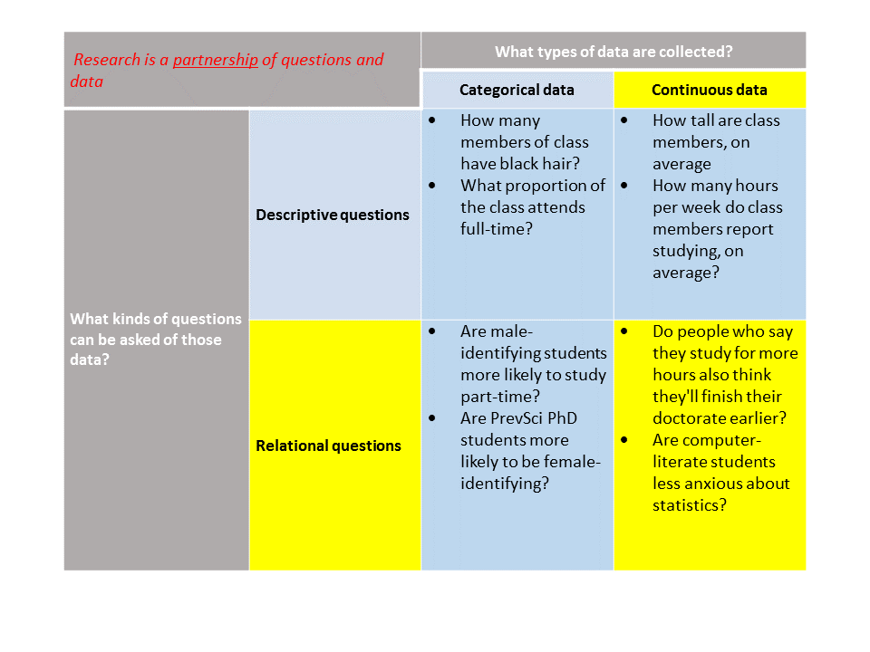

```{R, setup, include = F}
library(pacman)
p_load(here, tidyverse, xaringan, knitr, kableExtra, xaringanthemer, modelsummary)

i_am("slides/EDUC641_16_residuals.rmd")


red_pink <- "#e64173"
turquoise = "#20B2AA"
orange = "#FFA500"
red = "#fb6107"
blue = "#3b3b9a"
green = "#8bb174"
grey_light = "grey70"
grey_mid = "grey50"
grey_dark = "grey20"
purple = "#6A5ACD"
slate = "#314f4f"

extra_css <- list(
  ".red"   = list(color = "red"),
  ".blue"  =list(color = "blue"),
  ".red-pink" = list(color= "red_pink"),
  ".grey-light" = list(color= "grey_light"),
  ".purple" = list(color = "purple"),
  ".small" = list("font-size" = "90%"))

write_extra_css(css = extra_css, outfile = "my_custom.css")


# Knitr options
opts_chunk$set(
  comment = "#>",
  fig.align = "center",
  fig.height = 6.75,
  fig.width = 10.5,
  warning = F,
  message = F
)
opts_chunk$set(dev = "svg")
options(device = function(file, width, height) {
  svg(tempfile(), width = width, height = height)
})
options(knitr.table.format = "html")


hook_output <- knit_hooks$get("output")
knit_hooks$set(output = function(x, options) {
  lines <- options$output.lines
  if (is.null(lines)) {
    return(hook_output(x, options))  # pass to default hook
  }
  x <- unlist(strsplit(x, "\n"))
  more <- "..."
  if (length(lines)==1) {        # first n lines
    if (length(x) > lines) {
      # truncate the output, but add ....
      x <- c(head(x, lines), more)
    }
  } else {
    x <- c(more, x[lines], more)
  }
  # paste these lines together
  x <- paste(c(x, ""), collapse = "\n")
  hook_output(x, options)
})


```
# Roadmap

```{r, out.width = "90%", echo=F}
  
```

                                                       
---
# Goals of the unit

- Describe relationships between quantitative data that are continuous
- Visualize and substantively describe the relationship between two continuous variables 
- Describe and interpret a fitted bivariate regression line
- Describe and interpret components of a fitted bivariate linear regression model
- Visualize and substantively interpret residuals resulting from a bivariate regression model
- Conduct a statistical inference test of the slope and intercept of a bivariate regression model
- Write R scripts to conduct these analyses


---
# Reminder of motivating question

#### We learned a lot about the distribution of life expectancy in countries, now we are turning to thinking about relationships between life expectancy and other variables. In particular:

#### .blue[Do individuals living in countries with more total years of attendance in school experience, on average, higher life expectancy?]

#### In other words, we are asking whether the variables *SCHOOLING* and *LIFE_EXPECTANCY* are related.

---
# Materials

### 1. Life expectancy data (in file called life_expectancy.csv)
### 2. Codebook describing the contents of said data
### 3. R script to conduct the data analytic tasks of the unit
---
class: middle, inverse

# Our continuous relationship 


```{r, echo = F}
who <- read.csv(here("data/life_expectancy.csv")) %>%
  # first making variable names take a common format
  janitor::clean_names() %>% 
  # filtering to focus only on 2015
  filter(year == 2015) %>%
  # selecting only the variables we need
  select(country, status, schooling, life_expectancy) %>% 
  # renaming one of the variables that is really misnamed
  rename(region = country) %>% 
  # rounding life expectancy to nearest year
  mutate(life_expectancy = round(life_expectancy, digits = 0))

who <- filter(who, !is.na(schooling))
```

---
# A reminder of our relationship

```{r, echo=T}
biv <- ggplot(data = who, aes(x = schooling, y = life_expectancy)) + 
        geom_point() 
```
```{r, echo=F, fig.height=5.5}
biv <- biv +
  xlim(0, 22) +
  ylab("Life Expectancy (Yrs)") + xlab("Schooling (Yrs)") +
  scale_y_continuous(breaks = seq(40, 90, 10), limits = c(40, 90)) +
    theme_minimal(base_size = 16)

biv
```

---
# The results of our linear fit
```{r, echo=F, fig.height=4, highlight.output = (11:12)}
fit <- lm(life_expectancy ~ schooling, data=who)
summary(fit)
```

These .red-pink[**coefficients**] tell you where the fitted trend line should be drawn:
$$
\small{
\left[ \textrm{Predicted value of } LIFE\_EXPECTANCY\right]  = 
\left( 42.85 \right) + 2.23 * \left[ \textrm{Observed value of }SCHOOLING  \right] 
}
$$
---
# Fitted values

Can substitute values for the "predictor" $(SCHOOLING)$ into the fitted equation to compute the *predicted* values of $LIFE\_EXPECTANCY$. 
```{r, echo = F, fig.height=5.5}
fit <- lm(life_expectancy ~ schooling, data=who)
who$predict <- predict(fit)

fit_c <- lm(life_expectancy ~ schooling, data=who)
who$predict_c <- predict(fit_c)
who_chile <- filter(who, region=="Chile")

ggplot(who, aes(x = schooling, y = life_expectancy)) + 
  geom_point() + 
  geom_point(aes(y=predict), data=who_chile, col = "red", alpha=0.3) +
  geom_point(data = who_chile, aes(x=schooling, y = life_expectancy),
                    color = 'red',
                    size = 2) +
  geom_segment(aes(xend = schooling, yend=predict_c), col = "red", alpha = 0.3, data= who_chile) +
  annotate('text', label = "Chile", x = 15.5, y = 87, color = "red", size = 5) +
  xlim(0, 22) +
  ylab("Life Expectancy (Yrs)") + xlab("Schooling (Yrs)") +
  scale_y_continuous(breaks = seq(40, 90, 10), limits = c(40, 90)) +
    theme_minimal(base_size = 16)
```

--

Can do this for our old friend Chile ... and all others...

---
# Fitted values

So we can re-construct the line of best fit from the fitted values:

```{r, echo = F, fig.height = 5.5}
fit_val <- ggplot(who, aes(x = schooling, y = life_expectancy)) + 
  geom_point() + 
  geom_point(aes(y=predict), col = "red", alpha=0.3) +
  xlim(0, 22) +
  ylab("Life Expectancy (Yrs)") + xlab("Schooling (Yrs)") +
  scale_y_continuous(breaks = seq(40, 90, 10), limits = c(40, 90)) +
    theme_minimal(base_size = 16)
fit_val
```

---
# Fitted values

Note that the fitted line always goes through the average of the predictors
```{r, echo = F, fig.height = 5.5}
fit_val +
  geom_vline(xintercept = 12.93, col = "red", linetype="dashed") +
  geom_hline(yintercept = 71.74, col = "red", linetype= "dashed") +
  annotate('text', label = "(12.93,", x = 13.7, y = 68.5, color = "red", size = 4) +
  annotate('text', label = "71.74)", x = 13.7, y = 65.5, color = "red", size =4) +
    theme_minimal(base_size = 16)
```

---
# The regression equation

Each term in the regression equation has a specific interpretation

$$
\hat{LIFE\_EXPECTANCY} = 42.85 + 2.23 * \left( SCHOOLING \right)
$$

---
# The regression equation

Each term in the regression equation has a specific interpretation:

$$
\color{red}{\hat{LIFE\_EXPECTANCY}} = 42.85 + 2.23 * \left( SCHOOLING \right)
$$

The predicted value of $\color{red}{\hat{LIFE\_EXPECTANCY}}$ is based on the OLS regression fit. Its "hat" represents that it is a prediction.

---
# The regression equation

Each term in the regression equation has a specific interpretation:

$$
\hat{LIFE\_EXPECTANCY} = \color{red}{42.85} + 2.23 * \left( SCHOOLING \right)
$$

42.85 represents the .red[*estimated intercept*]. It tells you the predicted value of $LIFE\_EXPECTANCY$ when $SCHOOLING$ is zero (0)

- .blue[*In this context, it doesn't make sense to interpret this. Why?*]

---
# The regression equation

Each term in the regression equation has a specific interpretation:

$$
\hat{LIFE\_EXPECTANCY} = 42.85 + \color{red}{2.23} * \left( SCHOOLING \right)
$$

--

2.23 represents the .red[*estimated slope*]. It summarizes the relationship between $LIFE\_EXPECTANCY$ and $SCHOOLING$. It tells you the difference in the predicted values of $LIFE\_EXPECTANCY$ *per unit difference* in  $SCHOOLING$.

--

Slopes can be positive (as in this case) or negative. Here, we conclude that countries where children, on average, experience one additional year of schooling have an average life expectancy of 2.23 more years.

--

We do **NOT** say that increasing the average years that children attend school by one year increases average life expectancy in that country by 2.23 years. .blue[**Why?**]


---
# The regression equation

Each term in the regression equation has a specific interpretation:

$$
\hat{LIFE\_EXPECTANCY} = 42.85 + 2.23 * \left( \color{red}{SCHOOLING} \right)
$$

--

$\color{red}{SCHOOLING}$ represents the .red[*actual values*] of the predictor $SCHOOLING$.


---
class: middle, inverse

# Regression inference

---
# Regression inference

As with our categorical and single-variable continuous data analysis, we can ask whether we might have observed a relationship between $LIFE\_EXPECTANCY$ and $SCHOOLING$ by an idiosyncratic accident of sampling.

--

Could we have gotten a slope value of 2.23 by sampling from a population in which there was **no relationship** between $LIFE\_EXPECTANCY$ and $SCHOOLING$?

- In other words, by sampling from a *null population* in which the slope of the relationship between $LIFE\_EXPECTANCY$ and $SCHOOLING$ was zero?

---
# Regression inference

What is the probability that we would have gotten a slope value of 2.23 by sampling from a population in which there was **no relationship** between $LIFE\_EXPECTANCY$ and $SCHOOLING$?

```{r, echo=F, highlight.output = c(3:6), output.lines = -(1:7)}
summary(fit)
```

--

.small[As with our previous analysis, R provides us with a *p*-value which can help us to judge the likelihood that our results are driven by idiosyncrasies of sampling]

---
# Regression inference

```{r, echo=F, highlight.output = c(3:6), output.lines = -(1:7)}
summary(fit)
```

Here, the *p*-value for the $\frac{LIFE\_EXPECTANCY}{SCHOOLING}$ regression slope is $<0.0001$ (in fact, $<2^{-16}$). 

With an alpha-threshold of 0.05, $2^{-16}$ is definitely less than 0.05. Thus, we reject the null hypothesis that there is no relationship  between $LIFE\_EXPECTANCY$ and $SCHOOLING$, on average in the population.

---
# Writing it up
.pull-left[
```{r, echo=F}
ggplot(who, aes(x = schooling, y = life_expectancy)) + 
  geom_point() + 
  geom_smooth(method = lm, se = F) +
  xlim(0, 22) +
  ylab("Life Expectancy (Yrs)") + xlab("Schooling (Yrs)") +
  scale_y_continuous(breaks = seq(40, 90, 10), limits = c(40, 90)) +
    theme_minimal(base_size = 16)
```
]

.pull-right[
> **The story so far** <br> .small[In our investigation of country-level aggregate measures of schooling and life expectancy, we have found that the average years of schooling in a country is related to the average life expectancy. In particular, when we relate the country-level life expectancy (*LIFE_EXPECTANCY*) to the country-level mean years of schooling (*SCHOOLING*), we find that the trend-line estimated by ordinary-least-squares regression has a slope of 2.23 (*p*<0.0001). This suggests that two countries that differ in their average years of schooling attainment by 1 year will have, on average, a difference in life expectancy of 2.23 years. Of course, this relationship is far from causal...]

]

---
# Producing beautiful results

### A descriptive table (Table 1):
```{r, echo=F}
who1 <- select(who, -c(predict, predict_c))
```

```{r, echo=T}
library(modelsummary)
datasummary_skim(who1)
```

---
# Producing beautiful results

### A descriptive table (Table 1):
```{r, echo=T}
datasummary_skim(who1, histogram=F)
```

---
# Producing beautiful results
### A descriptive table (Table 1):

Saving it to a Word table:
```{r, echo=T}
datasummary_skim(who1, histogram=F,
                 output="table.docx")
```

---
# Producing beautiful results
### A descriptive table (Table 1):

For categorical variables

```{r, echo=T}
datasummary_skim(who1, 
                 type = "categorical")
```


---
# Producing beautiful results
### A descriptive table (Table 1):

Numeric variables by a categorical variable

```{r, echo=T}
datasummary_balance(~ status, # tells R to cut by this variable
                    data=who1)
```

---
# Producing beautiful results
### A descriptive table (Table 1):

Numeric variables by a categorical variable

```{r, echo=T}
datasummary_balance(~ status,
                    dinm = F, # drop the diff-in-means
                    data=who1)
```

---
# Producing beautiful results

### A regression output table (Table 2)
```{r, echo=T}
modelsummary(fit)
```

---
# Producing beautiful results

### A regression output table (Table 2)
```{r, echo=T}
modelsummary(fit, stars=T,
             gof_omit = "Adj.|AIC|BIC|RMSE",
             coef_rename = c("schooling" = "Yrs. Schooling"))
```

---
# Producing beautiful results

### A regression output table (Table 2)

Saving it to a Word table:
```{r, echo=T}
modelsummary(fit, stars=T,
             gof_omit = "Adj.|AIC|BIC|RMSE",
             coef_rename = c("schooling" = "Yrs. Schooling"),
             output="table2.docx")
```

---
class: middle, inverse

# A gentle introduction to bivariate regression: <br> Residual analysis

---
# Residual analysis
```{r, echo=F, fig.height=5}
ggplot(who, aes(x = schooling, y = life_expectancy)) + 
  geom_point() + 
  geom_point(aes(y=predict), col = "blue", alpha=0.3) +
  geom_segment(aes(xend = schooling, yend=predict), col = "green", alpha = 0.3) +
  geom_smooth(method = lm, se = F) +
  xlim(0, 22) +
  ylab("Life Expectancy (Yrs)") + xlab("Schooling (Yrs)") +
  scale_y_continuous(breaks = seq(40, 90, 10), limits = c(40, 90)) +
    theme_minimal(base_size = 16)
```

Our fitted regression line contains the "predicted" values of *LIFE_EXPECTANCY* for each value of *SCHOOLING*. But almost all of the "actual" values of *LIFE_EXPECTANCY* lie off the actual line regression line.

---
# An example: Chile

```{r, echo=F, fig.height=5}
resid_c <- ggplot(who, aes(x = schooling, y = life_expectancy)) + 
  geom_point() + 
  geom_smooth(method=lm, se=F, data=who) +
  geom_point(aes(y=predict), data=who_chile, col = "red", alpha=0.3) +
  geom_point(data = who_chile, aes(x=schooling, y = life_expectancy),
                    color = 'red',
                    size = 2) +
  geom_segment(aes(xend = schooling, yend=predict), col = "red", alpha = 0.3, data= who_chile) +
  annotate('text', label = "Chile", x = 15.5, y = 87, color = "red", size = 5) +
  xlim(0, 22) +
  ylab("Life Expectancy (Yrs)") + xlab("Schooling (Yrs)") +
  scale_y_continuous(breaks = seq(40, 90, 10), limits = c(40, 90)) +
    theme_minimal(base_size = 16)
resid_c
```

Observed values for Chile: $LIFE\_EXPECTANCY = 85$; $SCHOOLING = 16.3$ <br>
Predicted value of *LIFE_EXPECTANCY* for Chile:
$$
\begin{align}
\hat{LIFE\_EXPECTANCY} & = 42.85 + 2.23 * (16.3) \\
& = 79.20
\end{align}
$$
---
# An example: Chile
```{r, echo=F, fig.height=5}
resid_c
```
$\hat{LIFE\_EXPECTANCY} = 79.20$ <br>
Actual life expectancy = 85

--

.blue[*What can we say about the country of Chile's average life expectancy, relative to our prediction?*] 

---
# Now Egypt
```{r, echo=F, fig.height=5}
who_egypt <- filter(who, region == "Egypt")

resid_c +
   geom_point(data = who_egypt, aes(x=schooling, y = life_expectancy),
                    color = 'blue',
                    size = 3) +
   annotate('text', label = "Egypt", x = 12.1, y = 79, color = "blue", size = 5) +
    theme_minimal(base_size = 16)
```
Observed values for Egypt: $LIFE\_EXPECTANCY = 79$; $SCHOOLING = 13.1$ <br>

.blue[Can you calculate the predicted value of *LIFE_EXPECTANCY* for Egypt and compare it to the observed?]

---
# What is a "residual"?

#### The difference ("vertical distance") between the observed value of the outcome its predicted value is called the *residual*.

#### Residuals can be substantively and statistically useful:
- Represent individual deviations from average trend
- Tell us about values of the outcome after taking into account ("adjusting for") the predictor
 + In this case, tell us whether countries have better or worse life expectancies, given their average years of schooling
 
---
# Residual analysis

```{r, echo=T}
fit <- lm(life_expectancy ~ schooling, data=who)

# predict asks for the predicted values
who$predict <- predict(fit)

# resid asks for the raw residual
who$resid <- residuals(fit)
```

We can now treat these residual and predicted values as new variables in our dataset and examine using all the other univariate and multivariate analysis tools we have.

---
# Examining the residuals

```{r, echo=T}
summary(who$resid)
```

- Sample mean of the residuals is *always* exactly zero
- We've done a very poor job of predicting life expectancy for some countries

--

```{r, echo=T}
sd(who$resid)
```

- Standard deviation of the raw residuals can be quite useful in examining the quality of our fit.

--
.blue[How?]
 
---
# Residual assumptions

For the *p*-values that we computed in the regression analysis to be correct, the residuals **must be normally distributed**

```{r, echo=T, fig.height=4.5}
boxplot(resid(fit))
```

--

A few outliers, but we seem to be doing ok...

---
# Residual assumptions

For the *p*-values that we computed in the regression analysis to be correct, the residuals **must be normally distributed**<sup>1</sup>

```{r, echo=F, fig.height=4.5}
ggplot(who, aes(x = resid)) + 
  geom_histogram(binwidth = 1) +
    theme_minimal(base_size = 16)
```

.footnote[[1] We have solutions if they are not which we will learn about in EDUC 643. ]
--
Pretty good, pretty good...

--

.blue[**Understanding check:** can you write out the code to create the above figure?]


---
# Residual vs. fitted plot 

For the *p*-values that we computed in the regression analysis to be correct, the residuals **must be normally distributed**
```{r, echo=F, fig.height=4.5}
ggplot(who, aes(x = predict, y = resid)) + 
         geom_point() +
  geom_hline(yintercept = 0, color = "red", linetype="dashed") +
  ylab("Residuals") + xlab("Fitted values") +
  scale_y_continuous(limits=c(-20, 20)) +
    theme_minimal(base_size = 16)
```

#### Key assumption checks for normality:
- The residuals "bounce randomly" around the 0 line. 
- The residuals could be roughly contained within a rectangle around the 0 line. 
- No one residual "stands out" from the basic random pattern of residuals.

---
# Residual vs. fitted plot

For the *p*-values that we computed in the regression analysis to be correct, the residuals **must be normally distributed**
```{r, echo=F, fig.height=4.5}
ggplot(who, aes(x = predict, y = resid)) + 
         geom_point() +
  geom_hline(yintercept = 0, color = "red", linetype="dashed") +
  annotate('rect', xmin = 53.8, xmax = 59.5, ymin = -10, ymax = 15, alpha = 0.3, fill = "purple") +
  ylab("Residuals") + xlab("Fitted values") +
  scale_y_continuous(limits=c(-20, 20)) +
    theme_minimal(base_size = 16)
```

#### Key assumption checks for normality:
- The residuals "bounce randomly" around the 0 line. 
- The residuals could be roughly contained within a rectangle around the 0 line. 
- No one residual "stands out" from the basic random pattern of residuals.

---
# Implementing residual v. fitted

```{r, echo=T, fig.height=4.5}
ggplot(who, aes(x = predict, y = resid)) + 
         geom_point() +
  geom_hline(yintercept = 0, color = "red", linetype="dashed") +
  ylab("Residuals") + xlab("Fitted values") +
  scale_y_continuous(limits=c(-20, 20)) +
  theme_minimal(base_size = 16)
```

---
# Writing it up

> .small[In our investigation of country-level aggregate measures of schooling and life expectancy, we have found that the average years of schooling in a country is related to the average life expectancy. As we show in Table 2, when we relate the country-level life expectancy to the country-level mean years of schooling, we find that the trend-line estimated by ordinary-least-squares regression has a slope of 2.23 (*p*<0.0001). This suggests that two countries that differ in their average years of schooling attainment by 1 year will have, on average, a difference in life expectancy of 2.23 years.] 

```{r, echo=F}
modelsummary(fit, stars=T,
             gof_omit = "Adj.|AIC|BIC|RMSE",
             title = c("Table 2. Estimates of relationship between life expectancy and schooling"),
             coef_rename = c("schooling" = "Yrs. Schooling"),
             notes = c("Cells report coefficients and standard errors."))
```

---
# Writing it up II

> .small[An analysis of the residuals from our fitted model suggests that our regression assumptions are reasonably well met and we have appropriately characterized the relationship between schooling and life expectancy. Despite the presence of a few outliers, our residuals are roughly symmetrically distributed around 0. As we note in Appendix Figure A1, our fitted regression does seem to underpredict life expectancy for very low levels of schooling.]

```{r, echo=F, fig.height=4.5}
ggplot(who, aes(x = predict, y = resid)) + 
         geom_point() +
  geom_hline(yintercept = 0, color = "red", linetype="dashed") +
  ylab("Residuals") + xlab("Fitted values") +
  scale_y_continuous(limits=c(-20, 20)) +
  theme_minimal(base_size = 16) +
  ggtitle("Figure A1. Residuals vs. fitted plot of life expectancy and schooling")
```

---
# Key takeaways

- **Understand your data first**
 + Summarize and visualize each variable independently
 + Start with a visual representation of the relationship between your two variables
 + How you display the relationship will influence your perception of the relationship, but will not change the relationship
 + Try to describe what a particular observation in your visualized data represents
- **The regression model represents your hypothesis about the population**
 + When you fit a regression model, you are estimating *sample* values of *population* parameters that you will not directly observe
 + The goal of classical regression inference (just as with categorical relationships) is to understand how likely the observed data in your sample are in the presence of no relationship in the unobserved population
- **The regression model has a "smooth" and a "rough" component to it**
 + The "smooth" part is the portion of the relationship that your model explains
 + The "rough" part is the extent to which each observation (and the observations in aggregate) vary from the "smooth" part of your predictions
 + The "rough" parts (the residuals) provide important information on the extent to which our models satisfy their assumptions
 
.blue[**More on all of this in EDUC 643**]

---
class: middle, inverse
# Synthesis and wrap-up


---
# Goals of the unit

- Describe relationships between quantitative data that are continuous
- Visualize and substantively describe the relationship between two continuous variables 
- Describe and interpret a fitted bivariate regression line
- Describe and interpret components of a fitted bivariate linear regression model
- Visualize and substantively interpret residuals resulting from a bivariate regression model
- Conduct a statistical inference test of the slope and intercept of a bivariate regression model
- Write R scripts to conduct these analyses

---
# To Dos

### Reading
- LSWR Chapter 15.1 and 15.2: bivariate regression

### Assignments
- Assignment #4 Due November 29 at 11:59PM
- Quiz #5 on November 22/23 (due at 5pm)

### No class on 11/17!