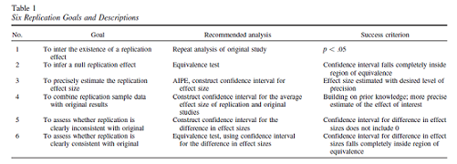
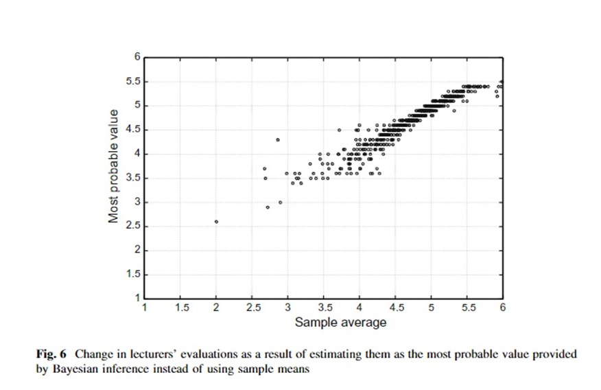

```{R, setup, include = F}
library(pacman)
p_load(here, tidyverse, ggplot2, xaringan, knitr, kableExtra, xaringanthemer, rstanarm)

i_am("slides/EDUC641_17_critiques.rmd")


red_pink <- "#e64173"
turquoise = "#20B2AA"
orange = "#FFA500"
red = "#fb6107"
blue = "#3b3b9a"
green = "#8bb174"
grey_light = "grey70"
grey_mid = "grey50"
grey_dark = "grey20"
purple = "#6A5ACD"
slate = "#314f4f"

extra_css <- list(
  ".red"   = list(color = "red"),
  ".blue"  =list(color = "blue"),
  ".green" = list(color = "green"),
  ".red-pink" = list(color= "red_pink"),
  ".grey-light" = list(color= "grey_light"),
  ".purple" = list(color = "purple"),
  ".large" = list("font-size" = "130%"),
  ".small" = list("font-size" = "90%"),
  ".tiny" = list("font-size" = "70%"),
  ".tiny2" = list("font-size" = "50%"))


# Knitr options
opts_chunk$set(
  comment = "#>",
  fig.align = "center",
  fig.height = 6.75,
  fig.width = 10.5,
  warning = F,
  message = F
)
opts_chunk$set(dev = "svg")
options(device = function(file, width, height) {
  svg(tempfile(), width = width, height = height)
})
options(knitr.table.format = "html")

```


# Goals of the unit

- Articulate modern critiques of null-hypothesis significance testing framework
- Describe strategies to improve replicability and generalizability of quantitative research

---
# Critiques of NHST

.large[**Two lines of criticism:**]

.large[
1. Concerns about generalizability and "statistical significance"
2. A different way of thinking about probability (Bayesian)
]

---
# Generalizability

### Research in WEIRD countries
- In 2015, 92 percent of all papers in developmental psychology featured participants from English-speaking countries and non-English-speaking Europe<sup>1</sup>
- In general, in social science much of our knowledge base comes from research conducting on participants living in Western, educated, industrialized, rich and democratic **(WEIRD)** nations

### Non-representative samples
- Even in WEIRD countries, many samples are not representative of the national population
 + University students (at highly research-active universities)
 + Non-Hispanic, White and male patients more likely to be included in clinical trials
 + Convenience sampling (especially in intervention and survey research)
 + Non-stratified samples prevents conclusion being drawn about low-*n* groups
- Small samples are particularly at risk for returning idiosyncratic estimates

.footnote[[1] Nielsen, M. Haun, D. Kartner, J & Legare, C. (2017). The persistent sampling bias in developmental psychology: A call to action. *Journal of Experimental Child Psychology, 162*, 31-38.]

--

**Learn more about all of this in EDUC 612 and 646!!**

---
class: middle, inverse

# Problems with "statistical significance"

---
# Problems with "significance"

An explosion of [academic](https://www.tandfonline.com/toc/utas20/73/sup1?nav=tocList) and [popular press](https://www.nytimes.com/2015/08/28/science/many-social-science-findings-not-as-strong-as-claimed-study-says.html) attention to the "replication crisis" emerged in the early 2010s. 


---
# Failure to reproduce

Replication work often seen as un-original; weak incentives to conduct replications.

Many replications fail:
.small[
- New contexts
- Incomplete communication of treatment and conditions
  + Missing protocol, methodological or data management details
  + Incomplete specification of sequence of tests
- Disagreement as to what "counts" as a replication
  + **In design:** Exact replication, conceptual replication, replication + extension
  + **In outcome:** 
]

```{r, echo=F}

```

.footnote[Anderson, S. & Maxwell, S. (2016). There's more than one way to conduct a replication study: Beyond statistical significance. *Psychological Methods, 21*(1), 1-12.]

---
# Problems with significance

Some problems with the binary decision-making process of NHST include:
- Statistical significance as a condition for publication and a goal for researchers
 + $\rightarrow$ Publication bias: "successes" are published; "failures" end up in file drawers
- Novelty as a condition for publication in top-tier journals
 + If something is "unexpected" or "surprising" there's a decent chance it might not be true
- Frequent imprecise estimates of "differences" between groups, with little interest in quantifying the magnitude of the differences
- Weak theory driving analysis: 
 + No non-null hypotheses
 + No prior belief about likelihood of findings
 + Hypothesis After the Results are Known (HARK-ing)
- Outright manufactured data/analysis

---
# Problems with "significance"

If *p*<0.05 is the goal, there are many ways to get there. 

This can be the product of intentional "*p*-hacking" or "researcher degrees of freedom" (explore your data, test many different models, try this variable, etc.)

--

At the core of this problem is the need to balance (avoid) two types of inference errors 

|               | **Reject $H_0$**        | **Fail to reject**
|--------------------------------------------------------------------
| $H_0$ = true  | .red-pink[Type I error] | .green[Correct decision]
| $H_0$ = false | .green[Correct decision]| .red-pink[Type II error]

--

The rate of false positives (.red-pink[**Type I errors**]) is equal to your $\alpha$-threshold. You choose this rate. 

---
# NHST and the trap of $p<0.05$

If you set the goal at 0.05 (or 0.01 or 0.001), that's what you'll get:

```{r, echo=F, out.height="80%"}

```

.footnote[Brodeur, A., Cook, N. & Heyes, A. (2020). Methods matter: p-Hacking and publication bias in causal analysis in economics. *American Economic Review, 110*(11), 3634-3660.]

---
# What should that distribution be?

.pull-left[
```{r, echo=F, out.height="80%"}

```
**What we observe**
]

.pull-right[
```{r, echo=F}
set.seed(12345)
# number of simulations
sims = 10000
# sample size
N = 30
# create empty vector for storing p-values
z_stat = numeric(sims) 
# loop
for(i in 1:sims){
  # draw sample
  sample = rnorm(n = N, 
                 mean = .2, 
                 sd = 1) 
  sample_mean = mean(sample) 
  sample_sd = sd(sample)
  se_mean = sample_sd/sqrt(N)
  sample_z = (sample_mean-0)/se_mean
  z_stat[i] = abs(sample_z)
}
```

```{r, echo = F}
data.frame(sim = 1:sims, z=z_stat) %>%
  ggplot(aes(x = z)) +
    geom_density(alpha = .4, fill = "grey")+
    theme_bw(base_size = 16) +
  labs(x = "z-stat", y = "frequency")
```
$H_0$ false, 10,000 simulations, $N=30, \mu=0.2, \sigma=1$
]


---
# Open Science alone won't save us

```{r, echo=F}

```

.footnote[Brodeur, A., Cook, N. Hartley, J. Heyes, A. (2022). Do pre-registration and pre-analysis plans reduce p-hacking and publication bias?]

---
## Dangers of multiple hypothesis testing

If your goal is to find a "statistically significant" result, you will detect such a relationship 1 out of 20 times (on average).

Imagine rolling a die. .blue[What is the probability you roll a 1?]

--
$1/6 = 0.167$

--

Now, roll it twice, .blue[what is the probability **at least** one of your rolls is a 1?]

--
$1 - (5/6 * 5/6) = 0.306$

--

If you conduct enough tests, you'll detect a relationship eventually.

---
# One fix

Instead of using $\alpha=0.05$ for each individual test, use $\alpha=0.05$ for the **family of tests** when we examine multiple contrasts to test a single hypothesis. 

.pull-left[
## Bonferroni method
Take a given $\alpha$-threshold and "split it" across the entire family of tests. Assuming $\alpha = 0.05$:
- For 2 tests, conduct each at 0.025 level;
- For 3 tests, conduct each at 0.0167 level; etc. ...

Use this new threshold to identify the critical $t$-statistic given the number of degrees of freedom.

.red-pink[*Other approaches exist! Bonferroni is an extremely conservative one--beware!*]
]

.pull-right[
As tests increase, so do critical $t$-values:

| # tests | # new $\alpha$ | $t$-statistic (df = $\infty$)
|-------------------------------------------------------------
| 1 | 0.0500 | 1.96
| 2 | 0.0250 | 2.24
| 3 | 0.0167 | 2.39
| 4 | 0.0125 | 2.50
| 5 | 0.0100 | 2.58
| 6 | 0.0083 | 2.64
| 10| 0.0050 | 2.81
| 20| 0.0025 | 3.02
| 50| 0.0010 | 3.29
|100| 0.0005 | 3.48

]
---
# Type II error

.red[**Equally important**] as the rate of false positives is the number of false negatives (.red-pink[**Type II errors**]) you're going to get. .blue[**Why do we care about this? Why not just set**] $\color{blue}{\alpha = 0.00000001}$.blue[?]

--

Failure to detect an effect when there is one there is just as important (but more often ignored) of a concern. Under-powered studies (studies that suffer from a high-likelihood of Type II error) have just as much potential to mis-inform us about the relative value of a particular intervention, practice or policy.

Type II error depends on the magnitude of the effect, the number of observations, the total variation in your variables, and the amount of the variation in the outcome you can explain. 

---
# Other data and analysis challenges

Small, subjective researcher choices *can* have meaningful effects on results of study. 

Take the "Many Analysts"<sup>1</sup> project in which 29 teams used the same dataset to address the same question: "Are soccer referees more likely to give red cards to dark-skin-toned players than to light-skin-toned ones?"

- Estimated effect sizes ranged from 0.89 to 2.93 (in odds-ratio units)
- 20 teams found a "significant" effect, 9 did not

.footnote[[1] Silberzahn, R. et al. (2018). Many analysts, one data set: Making transparent how variations in analytic choices affect results. *Advances in Methods and Practices in Psychological Science, 1*(3), 337-356.]

--

.purple[Critically, these were all studies done with the **exact same data** and the **exact same research question**!]

---
# Other data and analysis challenges

Never **EVER** use Excel to read in your data
```{r, echo=F}

```

--
More importantly, without being able to observe researcher decisions in their code, we can't assess the reasonableness of choices and the potential for replication. .red-pink[**We need to learn how to code and not just point-and-click for Open Science.**]

---
# The convoluted logic of NHST

Many of the preceding issues result from the fundamentally convoluted rationale of the null-hypothesis significance testing approach. An example:

Assume that we find that average national life expectancy is significantly greater in high-income countries compared to low-income countries. With an $\alpha$ of .05, the (hypothetical) statistical test returns *p* = .03, meaning we can reject the null hypothesis.

.blue[**Which of the following statements is correct, given *p* = .03**]:
* **A.** There is a 3% probability that high-income countries do not have a higher average life expectancy (the null hypothesis).
* **B.** There is a 3% probability that the results are due to sampling idiosyncrasy, rather than a true relationship in the population.
* **C.** A statistically significant difference means higher income-levels yield higher life expectancies.
* **D.** The observed data would occur 3% of the time if the null hypothesis were true.
* **E.** Previous research found that in 2005, income-level was not related to average life expectancy (*p* = .17). Therefore, income-level is more stronyl related to life expectancy in 2015 than in 2005.
* **F.** Another research group finds a statistically significant difference between countries with socialized medicine compared to those without (*p* = .001). Their smaller *p* value means that socialized medicine is more effective at increasing life expectancy than income level.

---
# The convoluted logic of NHST

.red-pink[**Only D on the previous slide is correct, yet all of these are commonly expressed in the scientific literature!**]

In frequentist statistics, we establish an **objective decision rule**: if our observed data has less than a 5 percent chance of occurring (or less than 1% or less than 0.1% or less than 10%) due to sampling idiosyncrasy, we will conclude that the observed relationship in the sample represents a true relationship in the population. 

- Once we set a threshold (an $\alpha$-theshold), we are making a binary decision about significance and non-significance
- Relationships are *NOT* "more" or "less" significant<sup>1</sup> 
 + In fact, the distribution of *p*-values under the null hypothesis is a uniform one; thus, it's not correct to describe observed vs. expected probabilities in relationship to each other (e.g., a *p*-value of 0.01 is **not** three times less likely than a *p*-value of 0.03). 
- This has become such an issue that in 2016, the American Statistical Association released a [statement](https://amstat.tandfonline.com/doi/pdf/10.1080/00031305.2016.1154108) touching on many of these issues, and a subset of committee members explicitly recommended to not use the term ["statistically significant"](https://www.tandfonline.com/doi/full/10.1080/00031305.2019.1583913)

.footnote[[1] This is the classical/standard way of thinking about inference. More recently, scholars have begun to question this way of thinking and consider this sort of comparison appropriate.]

--
- Many of these concerns relate to different ways of thinking about probability...

---
class: middle, inverse

# Bayesian probability and inference

---
# (Very) brief intro to probability

**Two common ways to think about probability: the long-run view (frequentist) and priors (Bayesian)**

- **Frequentist:**
- With a known long-run outcome (e.g., a fair coin comes up heads half the time), we can consider the likelihood of a given short-run event
 + A coin flipped twice will come up Heads both times with a probability of 0.25 (fairly likely); but a coin flipped 20 times will come up Heads every time with a probability of 0.000000095 (very unlikely)
 + In the short-run, you can expect some variability, but in the long run, it will converge to the known distribution

```{r, echo=F, fig.height=3.5}
set.seed(12345)
nsim = 2000
X = matrix(NA, ncol=2, nrow=nsim)
for(S in 1:nsim){
  X[S,1] = S
  X[S,2] = rbinom(n=1, size = S, prob = .5)/S
}
X = as.data.frame(X); names(X) = c("num", "coin")
coin_true <- X %>% ggplot(aes(x = num, y= coin)) + geom_line() + geom_hline(aes(yintercept = .5), color = "red", linetype = 2) +      scale_x_continuous("Number of tosses") + 
  scale_y_continuous("Proportion of heads", breaks = seq(0, 1, .1), limits = c(0,1)) +
    theme_minimal(base_size = 16)
coin_true
```

---
# Probability and testing $H_{0}$

We are asking how likely is it that we observe event X happening with Y frequency, if the expected probability of X happening is Z?

.blue[**Imagine you were handed a coin and asked to determine whether it was weighted to one side. How certain would you be after 50 flips?**]

```{r, echo=F, fig.height=3.5}
nsim = 2000
Y = matrix(NA, ncol=2, nrow=nsim)
for(S in 1:nsim){
  Y[S,1] = S
  Y[S,2] = rbinom(n=1, size = S, prob = .6)/S
}
Y = as.data.frame(Y); names(Y) = c("num", "coin")
filter(Y, num <=50) %>% ggplot(aes(x = num, y= coin)) + geom_line() + geom_hline(aes(yintercept = .5), color = "red", linetype = 2) + scale_x_continuous("Number of tosses") + 
  scale_y_continuous("Proportion of heads", breaks = seq(0, 1, .1), limits = c(0,1)) +
    theme_minimal(base_size = 16)

```

---
# Probability and testing $H_{0}$

We are asking how likely is it that we observe event X happening with Y frequency, if the expected probability of X happening is Z?

.blue[**Imagine you were handed a coin and asked to determine whether it was weighted to one side. How certain would you be after 200 flips?**]

```{r, echo=F, fig.height=3.5}
filter(Y, num <=200) %>% ggplot(aes(x = num, y= coin)) + 
  geom_line() + geom_hline(aes(yintercept = .5), color = "red", linetype = 2) + 
  scale_x_continuous("Number of tosses") + 
  scale_y_continuous("Proportion of heads", breaks = seq(0, 1, .1), limits = c(0,1)) +
    theme_minimal(base_size = 16)

```

---
# Probability and testing $H_{0}$

We are asking how likely is it that we observe event X happening with Y frequency, if the expected probability of X happening is Z?

.blue[**Imagine you were handed a coin and asked to determine whether it was weighted to one side. How certain would you be after 2000 flips?**]

```{r, echo=F, fig.height=3.5}
Y %>% ggplot(aes(x = num, y= coin)) + 
  geom_line() + 
  geom_hline(aes(yintercept = .5), color = "red", linetype = 2) + 
  scale_x_continuous("Number of tosses", limits = c(0,2000)) + 
  scale_y_continuous("Proportion of heads", breaks = seq(0, 1, .1), limits = c(0,1)) +
    theme_minimal(base_size = 16)

```


---
# Problems with probability

In frequentist statistics, we assume that the null hypothesis has as good a chance as any other hypothesis at being true, and we then test how likely we are to observe the data as we see them when the null is actually true...**but is this the right framework???**

How believable are the following findings?
- People who wear glasses are more likely to be empathetic $(p = 0.023)$
- Medical doctors have fewer close relationships than those in other professions $(p = 0.007)$
- People who engage in [power posing](https://www.nytimes.com/2017/10/18/magazine/when-the-revolution-came-for-amy-cuddy.html) experience increased testosterone $(p = 0.045)$ (*a real paper*)


--

Perhaps it is wiser to start with a *prior* belief about the probability of an event?

---
# Bayesian statistics

In contrast to frequentist approaches, Bayesian probability takes into account one's prior beliefs in determining the probability of an event
- Key insight: adjust current beliefs based on previous knowledge/beliefs
 + Adjust prior belief towards evidence in observed data
- Prior beliefs could come from theory, research or personal belief

#### Bayes Theorem (don't need to know this):

$$
\large P(A|B) = \frac{P(B|A)\cdot P(A)}{P(B)}
$$
--

I found this to be a helpful explainer [video](https://www.youtube.com/watch?v=HaYbxQC61pw).

---
# Bayesian Example
I have a theory that Oregonians are (generally) outdoors-y. I meet an outdoors-y person. What is the probability I have met an Oregonian?

$P(Oregonian) = 0.02$ (to make it simple 1 of 50 U.S. states) <br>
$P(Outdoorsy | Oregonian) = 0.65$ <br>
$P(Outdoorsy) = 0.20$

$$
\large P(Oregonian | Outdoorsy) = \frac{(0.65)(0.02)}{0.20} = 0.065
$$
--

Not surprisingly, I've updated my beliefs and now think there is a greater-than-base-rate likelihood (over 3x) that this person is an Oregonian. But it also tells me not to be too excited and claim the probability is 0.65 that I've met an Oregonian just because they are outdoors-y.

--

- Inferential statisticians (and applied researchers like yourselves) make statements like, "the chance we would observe differences between the treatment and control as large as the ones we did when there was actually no effect is less than 5%"
- Bayesian statisticians (and applied researchers like yourselves) make statements like, "the chance that the treatment is more effective than the control is 92%"

---
# An applied example

.pull-left[
University instructors are appraised based (in part) on student evaluations. [Fraile & Bausch-Morrell (2010)](https://link.springer.com/article/10.1007%2Fs10734-014-9823-0) collected data on these evaluations over two years.

They use the sample estimates from the first year of data, to estimate instructor evaluation ratings in the second year -- *given their prior evaluation ratings*.

The range of the Bayesian estimates for the Year 2 student evaluation ratings is narrower than the sample estimates (shrinks from score range of 2 - 6 to 2.5 - 5.5). The precision with which they make their estimates is much tighter. More to come on confidence intervals (or in Bayesian terms, credible intervals) in EDUC 643.
]

.pull-right[
```{r, echo=F}

```
]

---
# With our data

```{r, echo = F}
who <- read.csv(here("data/life_expectancy.csv")) %>%
  # first making variable names take a common format
  janitor::clean_names() %>% 
  # filtering to focus only on 2015
  filter(year == 2015) %>%
  # selecting only the variables we need
  select(country, status, schooling, life_expectancy) %>% 
  # renaming one of the variables that is really misnamed
  rename(region = country) %>% 
  # rounding life expectancy to nearest year
  mutate(life_expectancy = round(life_expectancy, digits = 0))

who <- filter(who, !is.na(schooling))
```

```{r, echo=T}
bayes <- stan_glm(life_expectancy ~ schooling, data = who,
                  prior=normal(3, 1), prior_intercept = normal(54, 4))
```
---
# With our data
```{r, echo=T}
print(bayes)
```
---
# Why not Bayes?

.large[
1. Selecting a prior can be **subjective**
2. Difficulty in finding informative prior
3. Disputes over value of uninformative priors
4. Similarity in results across approaches
5. Stasis
]

.large[.red[**Much more complexity to be explored in another course**]]

---
# A path forward...

So where does all this leave us? Some recommendations for moving forward:
1. Move beyond a single metric to evaluate practice and theory
 - Multiple studies w/ focus on generalizability
 - Replication studies
 - Systematic reviews/meta-analysis
 - Focus on *confidence intervals* and *magnitude* of effects (**more in EDUC 643**)

2. Open Science
 - Pre-registration (REES, OSF, etc.)
 - Registered reports
 - Public materials and data
 - Use of scripts!!!
 - Statistical tests (GRIM, SPRITE, etc.)

3. Changes in academic incentives

4. Recognition of the impact that subjective research decisions have on (some) quantitative empirical results


---
class: middle, inverse
# Synthesis and wrap-up


---
# Goals of the unit

- Articulate modern critiques of null-hypothesis significance testing framework
- Describe strategies to improve replicability and generalizability of quantitative research

---
# To Dos

### Final project 
Due Dec. 7, 11:59pm

### Re-submission
Assignments <13.5, resubmissions due on Canvas 12/2 at 5pm

### End-of-term SES

--

# .red[**Thanks!**]