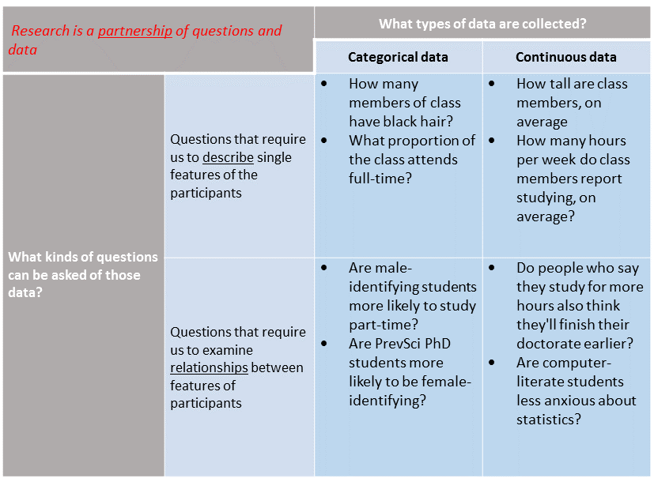
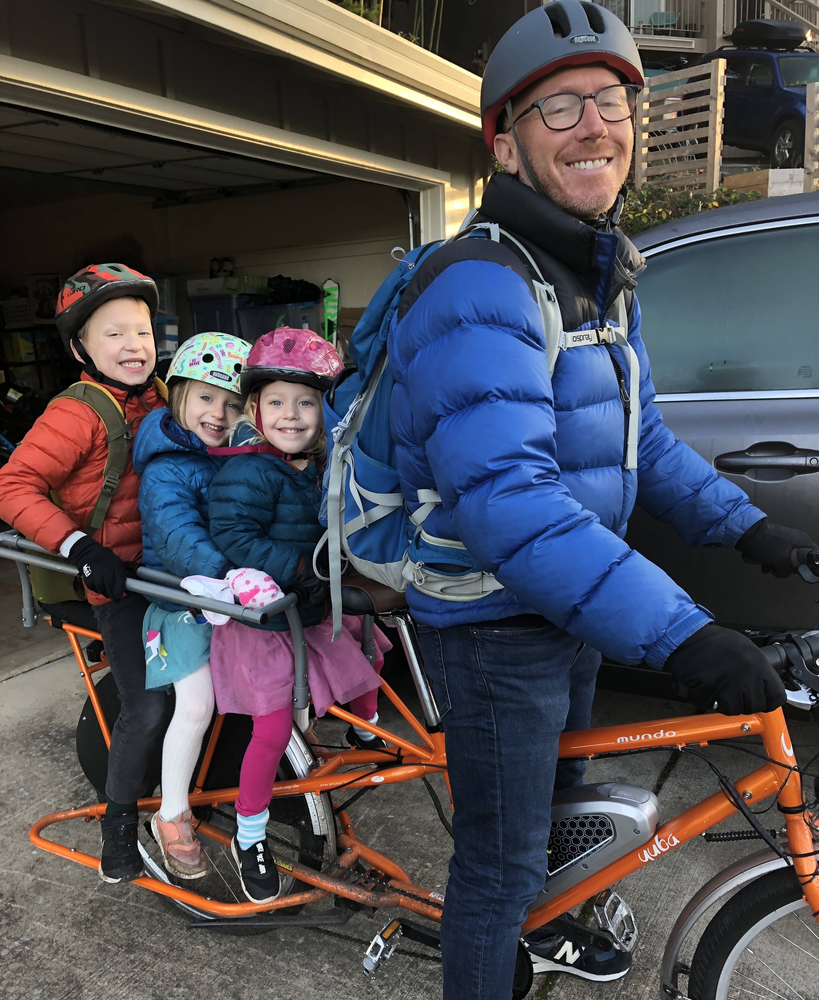

```{R, setup, include = F}
library(pacman)
p_load(here, tidyverse, ggplot2, xaringan, knitr, kableExtra, xaringanthemer)

i_am("slides/EDUC641_1_intro.rmd")


red_pink <- "#e64173"
turquoise = "#20B2AA"
orange = "#FFA500"
red = "#fb6107"
blue = "#3b3b9a"
green = "#8bb174"
grey_light = "grey70"
grey_mid = "grey50"
grey_dark = "grey20"
purple = "#6A5ACD"
slate = "#314f4f"

extra_css <- list(
  ".red"   = list(color = "red"),
  ".blue"  = list(color = "blue"),
  ".red-pink" = list(color= "red_pink"),
  ".grey-light" = list(color= "grey_light"),
  ".purple" = list(color = "purple"),
  ".large" = list("font-size" = "120%"),
  ".small" = list("font-size" = "90%"),
  ".tiny" = list("font-size" = "70%"),
  ".tiny2" = list("font-size" = "50%"))

write_extra_css(css = extra_css, outfile = "my_custom.css")

# Knitr options
opts_chunk$set(
  comment = "#>",
  fig.align = "center",
  fig.height = 6.75,
  fig.width = 10.5,
  warning = F,
  message = F
)
opts_chunk$set(dev = "svg")
options(device = function(file, width, height) {
  svg(tempfile(), width = width, height = height)
})
options(knitr.table.format = "html")

```
# Roadmap

```{r, out.width = "90%", echo=F}
  
```
---
# Agenda

.large[
1. Overview of course: goals, pedagogy and logistics
2. Research principles and design
]


---
# Class goals

.large[
1. Describe goals and structure and of the course (and the quantitative EDUC sequence more broadly) and principles of scientific research
]

---
# Goals of EDUC quant sequence

- Develop the basic quantitative skills necessary to conduct applied data analysis
 + The full-year sequence (EDUC 641 $\rightarrow$ EDUC 643 $\rightarrow$ EDUC 645) prepares you to make valuable contributions to a research team
 + Not all the skills you will need (and not the only courses you should take), particularly for those interested in analysis-heavy positions, or becoming an applied quantitative doctoral-level researcher
 + Foundations of statistics, methods and data science

- Understand the (in)appropriate application of those skills
 + "Building a toolbox, not a cookbook"
 + Evaluate the credibility of published research
 + Understand the affordances, limitations and dangers of quantitative analysis

--

.blue[This is an entirely re-designed and modernized core quantitative sequence at the COE. We welcome your feedback!] 

.blue[Given the new-ness of these three courses, there are likely to be shortcomings. We are committed to solving them as they arise, but we ask for your grace in allowing us to do so. In the end, we think this will be a better experience for you and your future program-mates.]

---
# Pedagogical orientation of EDUC

- Analysis follows research design that emerges from substantive questions
- Students learn statistical analysis by doing statistical analysis
- Start from an assumption of no prior background in mathematics, programming, statistics or research
- Create an inclusive, supportive environment in which we learn from each other
- Balance support and academic stretch across a variety of levels of prior experience and comfort with quantitative analysis

--

<br>

.blue[**Social conventions and schooling practices often convince some people, particularly women,  people of color and disabled individuals, that they are “bad at math.” We believe that quantitative skills, like any other skills, are built through regular practice, over time, and that all of our students can be successful in the EDUC quantitative sequence.**]

.blue[**We encourage all students, particularly those underrepresented in this field, to pursue the EDUC sequence and additional quantitative analysis courses in the COE and around the UO.**]

---
# Goals of EDUC 641

We will focus on describing categorical and continuous data and quantifying relationships between categorical and continuous data. Students will form a solid foundation for frequentist, inferential statistics (and some of critiques of this model). The course seeks to blend a conceptual, mathematical and applied understanding of basic statistical concepts.

Concrete learning objectives:
1. Articulate the principles of responsible and ethical quantitative research
2. Describe, summarize and visualize quantitative data that are categorical and continuous
3. Describe, summarize and visualize the relationships between quantitative data that are categorical and continuous
4. Conduct a frequentist null-hypothesis significance test of the relationships between simple categorical and continuous data
5. Describe strategies to improve the replicability and generalizability of quantitative research
6. Use the R programming language to conduct all such analyses

---
# My personal goals

- Over next two terms, teach you the basics of applied statistics
- Challenge you:
  + These courses assume .blue[*no prior knowledge*] of either programming or math, beyond high-school Algebra I
  + Thus, I hope EDUC 641 provides a smooth on-ramp for everyone
  + If you're struggling, come talk to me
  + If the course is too basic, consider either recommended texts for more formal mathematical treatment **AND/OR** the R Bootcamp extension activities (it will get more challenging) **AND/OR** reflect on pedagogical approaches as a future instructor
- Induct you into a graduate-level focus on mastery, rather than an undergraduate-level focus on success
- Contribute to building a community of live learners and life-long professional colleagues
- Assign everyone an A

---
# Me

.pull-left[
- David Liebowitz (aka, "David" or "Dr. Liebowitz")
- he/him
- English lit undergrad major
- Former ELA teacher and principal
- Policy analyst/advisor
- **Applied** quantitative social scientist focused on improving leadership and policy in schools serving low-family-income and racially minoritized students
- **Not** a methodologist
]

.pull-right[
```{r, echo=F}

```
]

--

.small[*Personal interests: I work and have kids, so I have no life, but when I can, I try to go for runs or play in the Cascade range.*]

---
# Roadmap of EDUC 641

| Unit  | Week(s) | Topic
|------------------------------------------------------------------------------
| 0     | 1       | Introduction to scientific principles and quantitative analysis
| 1     | 2       | Categorical descriptives
| 2     | 2-3     | Categorical relationships
| 3     | 4-6     | Continuous descriptives and inference
| 4     | 7-8     | Continuous relationships
| 5     | 9-10    | Threats and wrap-up


---
# Weekly schedule of activities

1. Two 1.5-hour lectures will introduce concepts in interactive lectures, discussion and activities
2. Readings are intended to supplement material from lectures (these can be completed after the first class of the unit)
3. Two *OPTIONAL, UNGRADED* weekly lab meetings intended to provide support for R programming tasks. Each lab will cover identical material.
4. Independent, asynchronous extension activities from the University of Oregon COE [R Bootcamp](https://community.uoregon.edu/courses/18778)
5. Five (5) quizzes worth trivial amount of points each (2% of grade)
6. Four (4) data analytic assignments (15% each) + final project (30% of grade)

--

<br>
Course website is (we hope!) a valuable resource. Let's check it out!

---
class: middle, inverse

# Principles of scientific research

---
# Roadmap

```{r, out.width = "90%", echo=F}
  
```

---
# Features of scientific research

<br>

.small[

### 1. Empirically based
### 2. Systematic
### 4. Defined sample and population
### 4. Contextualized
### 5. Reliabile and valid
### 6. Disprovable
### 7. Peer-reviewed

]


---
# Three facets of research

<br>

.pull-left[
### Design
- Where will you conduct research?
- Population of interest?
- Sample?
- Variables to examine?

### Measurement
- How will you collect data?
- How will you observe individuals' behavior?
- How will measurement be valid?
]

--

.pull-right[
### Analysis
- How will you process the data?
- How will you estimate relationships?
- How will you display results?
- How will you communicate findings?
]


---
# Research design and statistics

#### This sequence focuses on statistics, but **research design** is AS (MORE?) important
#### It can be tempting to use statistical techniques to fix poor research design
- "You can't fix by analysis what you bungled by design" -Light, Singer & Willett. (1990). *By Design*
- Make sure you master content from EDUC 612, particularly concepts of: 
 + measurement, internal and external validity
- Strongly encourage you to consider courses in advanced research design (EDUC 646, EDLD 650, EDLD 679) after completing the quantitative EDUC sequence

--

.blue[*You will explore (or have explored) these concepts in much more detail through EDUC 612. This is sort of like research design in 15 minutes.*]

---
class: middle, inverse
# Synthesis and wrap-up


---
# Class goals

.large[
1. Describe goals and structure and of the course (and the quantitative EDUC sequence more broadly) and principles of scientific research
]

---
# To-Dos

### Reading: 
- LSWR Chapter 2: this is a brief summary of what you have/will learn(ed) in EDUC 612 
- LSWR Chapter 3: this covers some information from the R Bootcamp and more 
    + You will **not** internalize all of this in one reading and practice session. Give it a skim, play around with R while you're doing so, and you can return to it as you want/need to build more of programming skills.
- Light, Singer & Willet (1990), pp. 1-40

### Assignment:
- Have downloaded R/RStudio and familiarized yourself with the RStudio environment (Modules 1 & 2 from [R Bootcamp](https://community.uoregon.edu/courses/18778))

