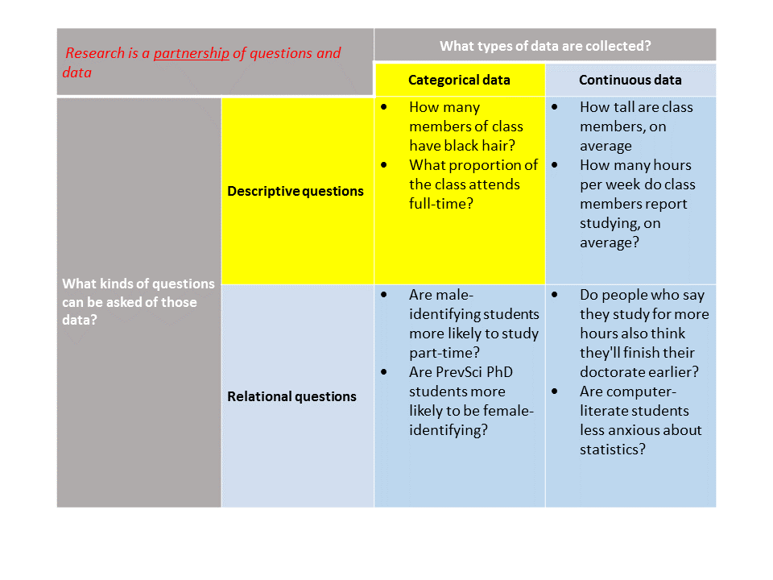

```{R, setup, include = F}
library(pacman)
p_load(here, tidyverse, ggplot2, xaringan, knitr, kableExtra, xaringanthemer)

i_am("slides/EDUC641_3_categdescr.rmd")


red_pink <- "#e64173"
turquoise = "#20B2AA"
orange = "#FFA500"
red = "#fb6107"
blue = "#3b3b9a"
green = "#8bb174"
grey_light = "grey70"
grey_mid = "grey50"
grey_dark = "grey20"
purple = "#6A5ACD"
slate = "#314f4f"

extra_css <- list(
  ".red"   = list(color = "red"),
  ".blue"  =list(color = "blue"),
  ".red-pink" = list(color= "red_pink"),
  ".grey-light" = list(color= "grey_light"),
  ".purple" = list(color = "purple"),
  ".large" = list("font-size" = "120%"),
  ".small" = list("font-size" = "90%"),
  ".tiny" = list("font-size" = "70%"),
  ".tiny2" = list("font-size" = "50%"))

write_extra_css(css = extra_css, outfile = "my_custom.css")

# Knitr options
opts_chunk$set(
  comment = "#>",
  fig.align = "center",
  fig.height = 6.75,
  fig.width = 10.5,
  warning = F,
  message = F
)
opts_chunk$set(dev = "svg")
options(device = function(file, width, height) {
  svg(tempfile(), width = width, height = height)
})
options(knitr.table.format = "html")

```
class: middle, inverse

# Quiz

---
# Roadmap

```{r, out.width = "80%", echo=F}
  
```

.blue[*This unit borrows heavily (with permission) from John B. Willett's course S-010Y*]

---
# Class goals

1. Understand and implement principles of tabular (rectangular) data in R
2. Describe and summarize quantitative data that are categorical
3. Create visualizations of quantitative data that are categorical
4. Write R scripts to conduct these analyses

---
# The story behind the data

.pull-left[
- [Warren McCleskey](https://www.theatlantic.com/politics/archive/2019/06/legacy-mccleskey-v-kemp/591424/) sentenced to death for murdering police officer during armed robbery in Georgia (1978)
- McCleskey appeals to the Supreme Court, arguing his death sentence is due to racial bias in sentencing...his appeal is rejected
- Senator Edward Kennedy sponsors the Racial Justice Act to enforce "the Constitution's promise of equality under the law"
- McCleskey executed in Georgia (1991)
]
.pull-right[
```{r, echo=F}

```
- [Baldus, Pulaski & Woodworth (1983). A comparative review of death sentences: An empirical study of the Georgia experience. *J. Crim Law.*](https://www.jstor.org/stable/1143133)

]

--

<br>
.blue[**Our motivating question: Were convicted murderers more likely to be sentenced to death in Georgia if they killed someone Black or if they killed someone White?**]

--

.red[*Note: Racial bias may exist in the criminal justice system irrespective of our answer to this question. Exploring such an issue would knit together more complete evidence from multiple research traditions.*]

---
# Goals of the unit

### We'll use a simplified version of the quantitative data accumulated by Baldus et al. (1983) to:
- Understand and implement principles of tabular data in R
- Describe and summarize quantitative data that are categorical
- Create visualizations of quantitative data that are categorical
- Write R scripts to conduct these analyses

---
# Materials

.large[
1. Death penalty data (in file called deathpenalty.csv)
2. Codebook describing the contents of said data (deathpenalty_codebook.pdf)
3. R script to conduct the data analytic tasks of the unit (EDUC641_3_code.R)
]

---
# Let's first access the data

Baldus, Pulaski and Woodworth (1983) compiled criminal justice and crude demographic information on all convicted murderers in the state of Georgia from in the mid-1970s. We have access to a simplified version of these data.

--


```{r, echo= T}
d <- read.csv('C:/Users/daviddl/Documents/EDUC/EDUC641_22F/data/deathpenalty.csv')
# but there are a lot of reasons to avoid using a hard-coded filepath
# so instead, we'll use our first R package

# Side note, I can write anything I want after a # sign and it 
# doesn't cause any problems for your program. These are called  
# comments and are critical to remind you (and tell others) what 
# you are doing!
```

---
# Let's first access the data

Baldus, Pulaski and Woodworth (1983) compiled criminal justice and crude demographic information on all convicted murderers in the state of Georgia from in the mid-1970s. We have access to a simplified version of these data.

```{r, echo=T}
# The first thing we'll do is to install the package
# install.packages("here")  <- when you do this, remove the #
# don't forget the quotes around the package name!
# Then, we'll load the package:

library(here)
```

--
While you're at it, do the same for `tidyverse` and `ggplot2` !

---
# Let's first access the data

Baldus, Pulaski and Woodworth (1983) compiled criminal justice and crude demographic information on all convicted murderers in the state of Georgia from in the mid-1970s. We have access to a simplified version of these data.

```{r, echo=T}
# Ok, now we're ready to get started:

df <- read.csv(here("data/deathpenalty.csv"))
# it is common in R to name our datasets short names 
# so as to reduce typing (df for dataframe)

```

--

#### but where did our data go?

---
# Understanding data structure

```{r, echo=T}
df
```

---
# Understanding data structure

```{r, echo=T}
names(df)
head(df)
```

Some vocabulary:
- .blue[**Observation**]: each row contains information on one person
- .blue[**Variable**]: each column (R stores these as "vectors")
- .blue[**Values**]: entries in the column


---
# Putting words to numbers

```{r, echo=T}
str(df)
```

--
We know from our codebook what this long list of numbers means, so let's make our dataset a little more readable...
```{r, echo=F}
df$rvictim <- factor(df$rvictim,
                      levels = c(1,2), labels=c("Black", "White"))
df$rdefend <- factor(df$rdefend,
                      levels = c(1,2), labels=c("Black", "White"))
```
```{r, echo=T}
df$deathpen <- factor(df$deathpen, 
                      levels = c(0,1), labels = c("No", "Yes"))
head(df)
```

---
# Questions go with data

### What sorts of questions could you ask already of this data?

> Based on the contents of this data, what questions can you think of that ask you to describe single variables?

--

> Based on the contents of this data, what questions can you think of that ask you to inquire about relationships between two or more variables?

---
# Summarizing data: Tables
One powerful thing to do with data is to just count it up. How many defendants were sentenced to death?

```{r, echo=T}
table(df$deathpen)
```

--

> From the *table* of the values of the variable *DEATHPEN*, we conclude ...

---
# Summarizing data: Charts
Even more powerful is to visualize these counts!

```{r, echo=T, fig.height=4}
counts <- table(df$deathpen)
barplot(counts, xlab = "Sentenced to Death?")
```

--

> Sometimes, *proportions* are better ... can you calculate by hand the proportion of defendants who are sentenced to death? 

---
# Summarizing data: Proportions
We can also ask R to do this for us

```{r, echo=T, fig.height=4}
prop <- prop.table(table(df$rvictim))
barplot(prop, xlab = "Race of Victim",
        ylab = "Proportion of victims")
```

> After inspecting this *chart of the proportions* of the variable *RVICTIM* in our data, we conclude ...

---
# Another way to visualize
Let's start to get familiar with the beauty of `ggplot`

```{r, echo=T, fig.height=4}
rd <- ggplot(df, aes(rdefend)) + geom_bar() +
         xlab("Race of Defendant") 
```

```{r, echo=F, fig.height=4}
rd + geom_text(aes(label = ..count..), stat='count', vjust = -0.5, size=6) +
    ylim(0,1550) +
    theme_minimal(base_size = 16)
```

> After inspecting this *chart* of the values of the variable *RDEFEND* in our data, we conclude ...

---
# BUT...


.large[

We still have not answered our motivating question: .blue[**Were convicted murderers more likely to be sentenced to death in Georgia if they killed someone Black or if they killed someone White?**]
]

--

.large[
We will do so next class and start our journey into the wild world of **statistical inference**!
]

--
(*how's that for a cliffhanger?*)

---
class: middle, inverse
# Synthesis and wrap-up

---
# Class goals

1. Understand and implement principles of tabular (rectangular) data in R
2. Describe and summarize quantitative data that are categorical
3. Create visualizations of quantitative data that are categorical
4. Write R scripts to conduct these analyses

---
# To-Dos

### Reading: 
- LSWR Chapter 6: an overview of graphing in R; great to return to again and again
- Evans (2020)

### Optional follow-up
- Complete R Bootcamp Module 3 (installing and loading a package)
- Complete R Bootcamp Module 9 (importing data)
- Complete R Bootcamp Module 11 (creating plots)
- Complete R Bootcamp Module 12 (creating a project)


### Assignment:
- Assignment #1 Due October 10, 11:59pm


