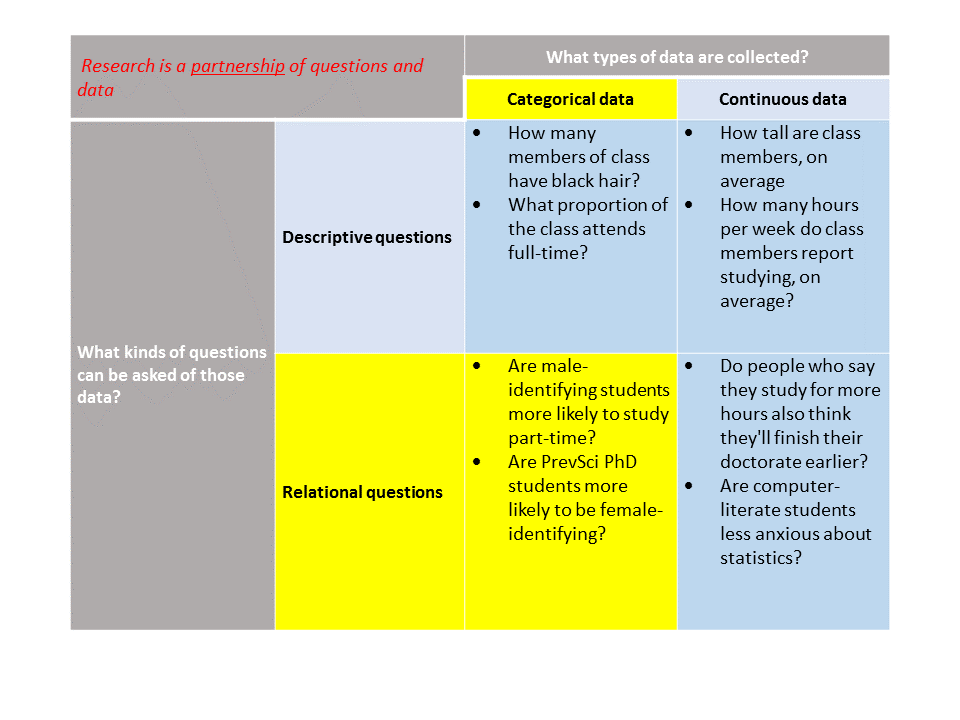
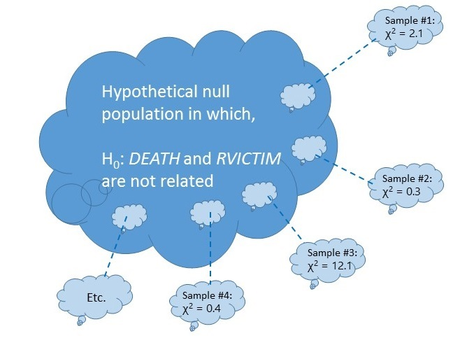
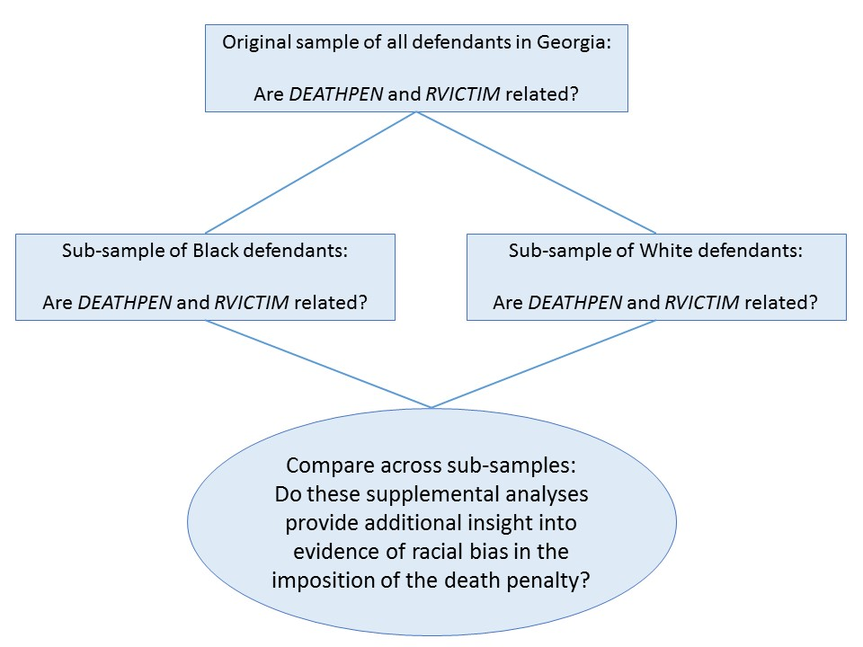

```{R, setup, include = F}
library(pacman)
p_load(here, tidyverse, ggplot2, xaringan, knitr, kableExtra, xaringanthemer)

i_am("slides/EDUC641_4_categrel.rmd")


red_pink <- "#e64173"
turquoise = "#20B2AA"
orange = "#FFA500"
red = "#fb6107"
blue = "#3b3b9a"
green = "#8bb174"
grey_light = "grey70"
grey_mid = "grey50"
grey_dark = "grey20"
purple = "#6A5ACD"
slate = "#314f4f"

extra_css <- list(
  ".red"   = list(color = "red"),
  ".blue"  =list(color = "blue"),
  ".red-pink" = list(color= "red_pink"),
  ".grey-light" = list(color= "grey_light"),
  ".purple" = list(color = "purple"),
  ".large" = list("font-size" = "120%"),
  ".small" = list("font-size" = "90%"),
  ".tiny" = list("font-size" = "70%"),
  ".tiny2" = list("font-size" = "50%"))


write_extra_css(css = extra_css, outfile = "my_custom.css")

# Knitr options
opts_chunk$set(
  comment = "#>",
  fig.align = "center",
  fig.height = 6.75,
  fig.width = 10.5,
  warning = F,
  message = F
)
opts_chunk$set(dev = "svg")
options(device = function(file, width, height) {
  svg(tempfile(), width = width, height = height)
})
options(knitr.table.format = "html")

```
# Roadmap

```{r, out.width = "90%", echo=F}
  
```
                                                          
---
# Goals of the unit

- Describe relationships between quantitative data that are categorical
- Calculate an index of the strength of the relationship between two categorical variables, the chi-squared ( $\chi^2$) statistic
- Write R scripts to conduct these analyses
- Formulate and describe the purpose of a null hypothesis
- Conceptually describe the criteria to make a statistical inference from a sample to a population
- Interpret and report the results of a contingency-table analysis and a statistical inference from a chi-squared statistic

---
# Reminder of motivating question


.blue[**Were convicted murderers more likely to be sentenced to death in Georgia if they killed someone Black or if they killed someone white?**]

---
class: middle, inverse
# Relationships between variables

---
# Two-way tables

.small[Now we seek to create a *joint display* of the values of *RVICTIM* and *DEATHPEN*]
```{r, echo= F}
df <- read.csv(here("data/deathpenalty.csv"))
df$rvictim <- factor(df$rvictim,
                      levels = c(1,2), labels=c("Black", "White"))
df$rdefend <- factor(df$rdefend,
                      levels = c(1,2), labels=c("Black", "White"))
df$deathpen <- factor(df$deathpen, 
                      levels = c(0,1), labels = c("No", "Yes"))

```

```{r, echo=T}
table(df$deathpen, df$rvictim)
```

--
.small[Could do this other ways...]
```{r, echo=T}
xtabs(formula = ~ deathpen + rvictim, data = df)
```

---
# Two-way tables

#### Can ask R for this too:
```{r, echo=T}
round(prop.table(table(df$deathpen, df$rvictim), margin=2)*100, 2)
```

--
### Putting it into words

> In our sample of convicted murderers in Georgia, when a **Black person** was a victim...

--

> In our sample of convicted murderers in Georgia, when a **white person** was a victim...

---
# Grouped charts

```{r, echo=T, fig.height=5}
group <- ggplot(df, aes(x = rvictim, fill = deathpen)) +
                geom_bar(position = "dodge") + 
                xlab("Race of victim")
```

```{r, echo=F, fig.height=5}
group + theme_minimal(base_size = 16) +
        scale_fill_discrete(name = "Death sentence?")
```

---
# Observed vs. Expected

.pull-left[
####Frequencies that we OBSERVE
```{r, echo=F}
two_way <- table(df$deathpen, df$rvictim)
addmargins(two_way)
```
]

.pull-right[
####Frequencies that we would EXPECT if there were NO relationship 

|deathpen   | Black | White | Sum   | Proport.
|------------------------------------------------
|No         |       |       | 2346  | 0.948
|Yes        |       |       | 129   | 0.052
|Sum        | 1506  |  969  | 2475  | 1.000
|Proportion | 0.608 | 0.392 | 1.000 |
]

--

<br>

*Note*: The proportions above are rounded, so if you use them to calculate the **EXPECTED** values, they will differ slightly from those on the next slide. If you calculate the proportions by hand (i.e., $1506/2474 = 0.60\overline{84}$), you will get the exact values, and then they will align with the rounded **EXPECTED** values on the next slide.

---
# Observed vs. Expected

.pull-left[
####Frequencies that we OBSERVE
```{r, echo=F}
two_way <- table(df$deathpen, df$rvictim)
addmargins(two_way)
```
]

.pull-right[
####Frequencies that we would EXPECT if there were NO relationship 
```{r, echo=F}
df <- df %>% group_by(rvictim) %>% mutate(sum_rvictim = n())
df <- df %>% group_by(deathpen) %>% mutate(sum_deathpen = n())

df <- ungroup(df) %>% mutate(prop_rvictim = sum_rvictim / n())
df <- ungroup(df) %>% mutate(prop_deathpen = sum_deathpen / n())

df <- df %>% group_by(rvictim) %>% mutate(expec_death = sum_rvictim * prop_deathpen)

df2 <- df %>% group_by(deathpen, rvictim) %>% summarise(expec_death = round(mean(expec_death), 0))
sum_ref <- df %>% group_by(deathpen) %>% summarise(Sum = n())
df2 <- left_join(df2, sum_ref, by = c("deathpen"))
 
  df3 <- df2 %>% spread(rvictim, expec_death) %>% relocate(Sum, .after = last_col())
  
sum_vict <- df %>% group_by(rvictim) %>% summarise(sum_rvictim = n())
  sum_vict <- sum_vict %>% spread(rvictim, sum_rvictim)
  tot <- ungroup(df) %>% summarise(Sum = n())
  death <- c("Sum") %>% as.data.frame() %>% setNames(c("deathpen"))
   
  sum_vict <- cbind(death, sum_vict, tot)
  
  df3 <- rbind(df3, sum_vict)

kable(df3, format='html')
  
```
]

--

<br>
> What do you think? Is there a relationship between *DEATHPEN* and *RVICTIM*?

---
# A desired index...?

.pull-left[
####Frequencies that we OBSERVE
```{r, echo=F}
two_way <- table(df$deathpen, df$rvictim)
addmargins(two_way)
```
]
.pull-right[
####Frequencies that we would EXPECT if there were NO relationship 
```{r, echo=F}
kable(df3, format='html')
```
]

<br>
#### It would be nice to have an index of the **NET DISCREPANCY** between the **OBSERVED** and **EXPECTED** frequencies in the sample

---
# The Chi-Squared $\chi^2$ statistic

For a moment, assume that there is a powerful statistic that allows us to summarize the **NET DISCREPANCY** between the tables of **OBSERVED** and **EXPECTED** frequencies. Let's call this statistic the Pearson Chi-Squared $(\chi^2)$ statistic

.pull-left[
####Frequencies that we OBSERVE
```{r, echo=F}
two_way <- table(df$deathpen, df$rvictim)
addmargins(two_way)
```
]
.pull-right[
####Frequencies that we would EXPECT if NO relationship 
```{r, echo=F}
kable(df3, format='html')
```
]

--

<br>
$$ \chi^2 = \frac{(1483-1428)^2}{1428} + \frac{(863-918)^2}{918} + \frac{(23-78)^2}{78} + \frac{(106-51)^2}{51} $$
$$ \chi^2 = 103.8 $$
--

Yay! We got an answer, but what does it mean...?

---
class: middle, inverse
# Hypothesis testing and statistical inference

---
# Big or small?

We can summarize the **NET DISCREPANCY** between the tables of **OBSERVED** and **EXPECTED** frequencies, using a statistic called the Pearson Chi-Squared ( $\chi^2$) statistic

.pull-left[
####Frequencies that we OBSERVE
```{r, echo=F}
two_way <- table(df$deathpen, df$rvictim)
addmargins(two_way)
```
]
.pull-right[
####Frequencies that we would EXPECT if NO relationship 
```{r, echo=F}
kable(df3, format='html')
```
]

<br>

$$ \chi^2 = 103.8 $$
--

Decision rule: If $\chi^2$ is big, then declare that there is a relationship between *DEATHPEN* and *RVICTIM*; if $\chi^2$ is zero (or close), then declare there is no relationship between *DEATHPEN* and *RVICTIM*...

--
but what is **BIG**, what is **close to zero**, and is 103.8 **big** or **close to zero**?

--

For that we will use the this statistic to conduct a $\color{red}{\chi^2}$ .red[**goodness-of-fit**] test.

---
# Statistical inference

Let's take a step back to capture the nature of the problem
- We've looked at some data on some convicted murderers in the state of Georgia
- We're not interested in only *these* murderers, but we're interested in a broader *population* of murderers from which our *sample* was drawn
  + In fact, even if we could observe outcomes for all murderers in the state of Georgia, our observation of them is imperfect due to *measurement error* and so we only ever observe samples, never populations (more on this later)
- Is there something about sampling from a population that could resolve our problem?
- Is there some way to generalize our conclusions about our *sample* relationship between *DEATHPEN* and *RVICTIM* to the *underlying population*?
  + This is called *statistical inference* and it is *the* critical contribution of quantitative methods to research

---
# Sampling idiosyncrasy

#### When you generalize from a sample back to its underlying population, you must be careful that your empirical study has not been the victim of *sampling idiosyncrasy*

#### Is the following scenario plausible?
- There really is no relationship between *DEATHPEN* and *RVICTIM* **in the population**
- By accident, we have drawn an idiosyncratic sample from the population
- This sampling idiosyncrasy ended up giving us a $\chi^2$ statistic as large as 103.8 by pure accident

#### How can we assess the plausibility of this scenario? 

---
# The Null Hypothesis $(H_{0})$

We start by imagining a hypothetical world in which there is **no relationship** between *DEATHPEN* and *RVICTIM* in a true population of convicted murderers. Then, we imagine drawing a series of samples of convicted murders over and over again (say...10,000 times) from this hypothetical population. What values of the $\chi^2$ statistic might we observe?

```{r, out.width = "70%", echo=F}
  
```

---
# Testing the null

In this hypothetical example of repeated sampling from a null population, we could record all 10,000 values of the $\chi^2$ statistic
```{r, echo=F, fig.height=5.25}
set.seed(123456)
chsq <- data.frame(Chi_Square=rchisq(1:10000, df=1))
ch <- ggplot(chsq, aes(Chi_Square)) + geom_histogram() +
            theme_minimal(base_size = 16)
ch
```

The histogram summarizes the natural variation that could occur in a $\chi^2$ statistic as a result of *random sampling idiosyncrasy*, after drawing repeated samples from a hypothetical population in which there is no relationship between *DEATHPEN* and *RVICTIM*.

---
# Testing the null

In this hypothetical example of repeated sampling from a null population, we could record all 10,000 values of the $\chi^2$ statistic
```{r, echo=F, fig.height=5.25}
ch + geom_vline(xintercept = 5, color = "blue", linetype = "dashed", size=1.5)
```

.blue[*If this were the histogram that could result from sampling idiosyncrasy, and this were the value of the chi-square statistic, what would you think?*]

---
# Testing the null

In fact, this is the value of the $\chi^2$ statistic we observed:
```{r, echo=F, fig.height=4.5}
ggplot(chsq, aes(Chi_Square)) + 
  geom_histogram(binwidth = 1) + 
  geom_vline(xintercept = 103.8,  color = "red", size=1.5) +
    theme_minimal(base_size = 16)
```

--

.blue[*This is a histogram of possible chi-square values that could result from sampling idiosyncrasy, and then the actual value of the chi-squared statistic in our sample. What do you think?*]

--

*WOOHOO!* In this thought exercise, you've just engaged in a rudimentary version of .red[*Null-Hypothesis Significance Testing (NHST)*]; the bedrock of most social science research.

---
# Testing the null (*p*-values)

In fact, we don't need to examine the full histogram. Instead, we can say that in a hypothetical exercise of sampling repeatedly from a null population, less than 1 in a 1,000,000,000,000,000 (trillion) of all accidental values of the $\chi^2$ statistic are larger than a value of 103.8

```{r, echo=F, fig.height=4.5}
ggplot(chsq, aes(Chi_Square)) + 
  geom_histogram(binwidth = 1) + 
  geom_vline(xintercept = 103.8,  color = "red", size=1.5) +
    theme_minimal(base_size = 16)
```

--

The statistic that captures the probability of observing a $\chi^2$ statistic of a given magnitude in a particular sample, in the presence of a null population, is called the .red[*p*-value]


---
# Testing the null (*p*-values)

.blue[*At what p-value would you start to believe that the value of the*] $\color{blue}{\chi^2}$ .blue[*statistic in your own research was "big" (i.e., was unlikely to have occurred by accident)*]
```{r, echo=F, fig.height=5}
ggplot(chsq, aes(x=Chi_Square)) + geom_density(fill="pink", alpha=0.2) +
  scale_x_continuous("Chi-Square values", limits = c(0,10)) +
    theme_minimal(base_size = 16)
```

---
# Testing the null (*p*-values)

.blue[*At what p-value would you start to believe that the value of the*] $\color{blue}{\chi^2}$ .blue[*statistic in your own research was "big" (i.e., was unlikely to have occurred by accident)*]
```{r, echo=F, fig.height=5}
chsq_right <- density(chsq$Chi_Square, from = 3.84, to = max(chsq$Chi_Square))
chsq_data <- data.frame(x = chsq_right$x, y = chsq_right$y)
ggplot(chsq, aes(x=Chi_Square)) + geom_density(fill="pink", alpha=0.2) +
 geom_area(data = chsq_data, aes(x=x, y=y), fill = "blue", alpha=0.2) +
  geom_vline(xintercept=3.84, color = "red", size = 0.5, linetype = "dashed") +
  scale_x_continuous("Chi-Square values", limits = c(0,10)) +
  scale_y_continuous("density") +
    theme_minimal(base_size = 16)
```

--

.small[In social science research, it is customary to (arbitrarily) set that threshold at **5 percent (*p*<0.05)**. In other words, we say that if the difference between our observed data and our expected data would have happened in fewer than 1 out of 20 randomly drawn samples, that the difference reflects a true difference in the population.]

---
# Testing the null (*p*-values)

.blue[*In social science research, it is customary to (arbitrarily) set an alpha-threshold and conduct a Null-Hypothesis Significance Test*]
```{r, echo=F, fig.height=5}
chsq_right <- density(chsq$Chi_Square, from = 3.84, to = max(chsq$Chi_Square))
chsq_data <- data.frame(x = chsq_right$x, y = chsq_right$y)
ggplot(chsq, aes(x=Chi_Square)) + geom_density(fill="pink", alpha=0.2) +
 geom_area(data = chsq_data, aes(x=x, y=y), fill = "blue", alpha=0.2) +
  geom_vline(xintercept=3.84, color = "red", size = 0.5, linetype = "dashed") +
  scale_x_continuous("Chi-Square values", limits = c(0,10)) +
  scale_y_continuous("density") +
    theme_minimal(base_size = 16)
```

--

.blue[**Is this the right thing to do? At the end of the course, we will revisit this concept.**]

---
class: middle, inverse
# Incorporating a third variable

---
# Sub-sample comparisons

There are more complex ways of doing this, but one approach is to replicate the original contingency table analysis in interesting "slices" of the sample, defined by a third variable

--

```{r, out.width = "80%", echo=F}
  
```

---
# Cases with Black murderers

```{r, echo=T}
df_b <- filter(df, rdefend == "Black")
table(df_b$deathpen, df_b$rvictim)
```

.pull-left[
#### Black murderers, Black victims
When a Black victim is killed by a Black murderer,
$$ \frac{18}{18+1304} = 1.36 \% $$
of the murderers are sentenced to death.
]

.pull-right[
#### Black murderers, White victims
When a White victim is killed by a Black murderer,
$$ \frac{50}{50+63} = 44.25 \% $$
of the murderers are sentenced to death.
]

--

The percentage of Black murderers sentenced to death for killing a White victim is about 32.5 times the percentage of Black murderers sentenced to death for killing a Black victim, in Georgia

---
# A statistical test

.pull-left[
```{r, echo=F}
chi_b <- chisq.test(df_b$deathpen, df_b$rvictim)
```
Observed:
```{r, echo=F}
chi_b$observed
```
Expected:
```{r, echo=F}
round(chi_b$expected, 0)
```
$\chi^2$ statistic:
```{r, echo=F}
chi_b$statistic
```
*p*-value
```{r, echo=F}
chi_b$p.value
```
]

--

.pull-right[
- $H_{0}$: *DEATHPEN* and *RVICTIM* are unrelated in the population of convicted Black murderers in GA
- $\chi^2$ statistic: 414.7
- *p*-value: <0.0001
- Decision: Reject $H_{0}$
- Conclusion: There is a statistically significant relation between the assignment of the death penalty and the race of the victim, on average, in the population of Black murderers in GA.
]

---
# Cases with White murderers

```{r, echo=F}
df_w <- filter(df, rdefend == "White")
table(df_w$deathpen, df_w$rvictim)
```

.pull-left[
#### White murderers, Black victims
When a Black victim is killed by a White murderer,
$$ \frac{5}{5+179} = 2.71 \% $$
of the murderers are sentenced to death.
]

.pull-right[
#### White murderers, White victims
When a White victim is killed by a White murderer,
$$ \frac{56}{56+800} = 6.89 \% $$
of the murderers are sentenced to death.
]

--

The percentage of White murderers sentenced to death for killing a White victim is about 2.5 times the percentage of White murderers sentenced to death for killing a Black victim, in Georgia

---
# A statistical test

.pull-left[
```{r, echo=F}
chi_w <- chisq.test(df_w$deathpen, df_w$rvictim)
```
Observed:
```{r, echo=F}
chi_w$observed
```
Expected:
```{r, echo=F}
round(chi_w$expected, 0)
```
$\chi^2$ statistic:
```{r, echo=F}
chi_w$statistic
```
*p*-value
```{r, echo=F}
chi_w$p.value
```
]

--

.pull-right[
- $H_{0}$: *DEATHPEN* and *RVICTIM* are unrelated in the population of convicted White murderers in GA
- $\chi^2$ statistic: 3.35
- *p*-value: 0.067
- Decision: Fail to reject $H_{0}$
- Conclusion: There is not a statistically significant relation between the assignment of the death penalty and the race of the victim, on average, in the population of White murderers in GA.


- Note that we **NEVER** accept the null-hypothesis. We only ever *fail to reject* it.
]

---
# Putting it all together

### Basic steps of classical statistical inference
1. State a research question, including a null hypothesis $(H_{0})$ which states there exists no relationship between our variables of interest
2. Display and describe the observed data
3. Summarize the observed data in relationship to an expected value
4. Set a threshold at which we will no longer believe that the discrepancy between the observed and expected relationship is due to sampling idiosyncrasy
5. Estimate the *p*-value
6. Reject or fail to reject the null hypothesis
7. Interpret your findings drawing explicitly on plots, summary statistics and test statistics

---
# Our intepretation

> In the population of convicted murderers in Georgia, the imposition of the death penalty and the race of the victim are related ( $\chi^2$ = 103.8, *p*< 0.001) The percentage of convicted murderers who were sentenced to death after killing a White victim was more than 8 times the percentage of convicted to murderers who were sentenced to death after killing a Black victim. In Figure 1, we show... 

> This phenomenon is largely driven by the imposition of the death penalty on Black defendants. Courts sentenced Black defendants to death for killing White victims at more than 32 times the frequency than when they were convicted of killing Black defendants ( $\chi^2$ = 414.7, *p*<0.001); whereas, we detect no statistical difference between White defendants convicted of murdering White compared to Black victims ( $\chi^2$ = 3.3, *p*=0.067). In Table 1, we show...

---

# Estimating the $\chi^2$ statistic in R

```{r, echo=T}
chi_df <- chisq.test(df$deathpen, df$rvictim)
chi_df
chi_df$expected
round(chi_df$p.value, 5)
```

---
class: middle, inverse
# Synthesis and wrap-up

---
# Goals of the unit

- Describe relationships between quantitative data that are categorical
- Calculate an index of the strength of the relationship between two categorical variables, the chi-squared ( $\chi^2$) statistic
- Write R scripts to conduct these analyses
- Formulate and describe the purpose of a null hypothesis
- Conceptually describe the criteria to make a statistical inference from a sample to a population
- Interpret and report the results of a contingency-table analysis and a statistical inference from a chi-squared statistic

---
# To-Dos

### Reading
- LSWR Chapter 11: hypothesis testing
- LSWR Chapter 12: categorical data analysis (chi-square test focus)
    + Please do not worry about fully understanding the discussions on sampling distributions, degrees of freedom, one- vs. two-sided tests, or variations of chi-squared calculations **(Sections 11.3, 11.4.3, 11.7, 11.8, 12.1.4-12.1.8, 12.3-12.9)**. We will (partially) cover these topics in future classes.
- Levy (2019)
    + Last name A-H: Clayton; Last Name I-P: Evans; Last Name R-Z: Levy
    + Prep to summarize main ideas and supporting details

### Optional follow-up
- Complete R Bootcamp Module 6 (matrices)
- Complete R Bootcamp Module 7 (lists)

### Assignments
- Quiz on Units 1 & 2 next class (10/13)
- Assignment #2 Due October 19, 11:59pm


