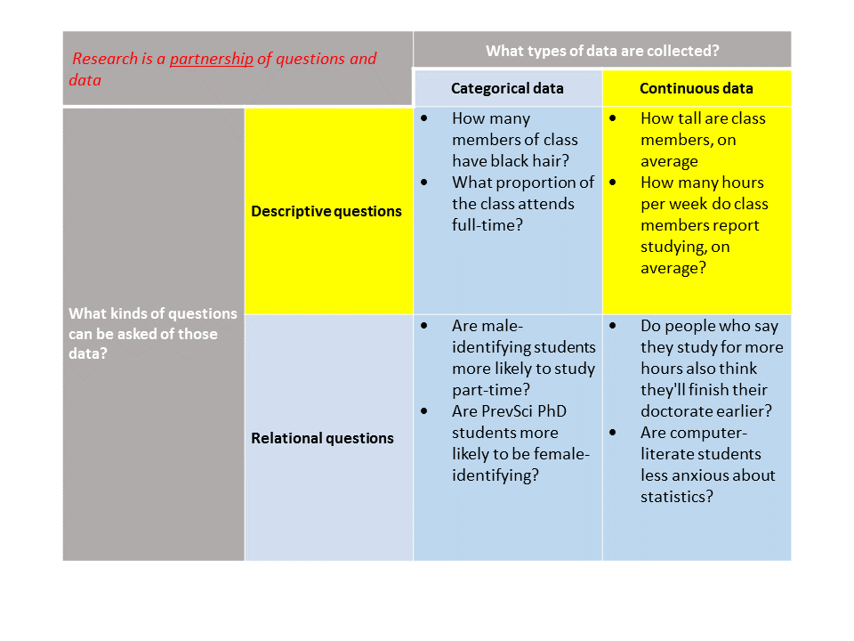
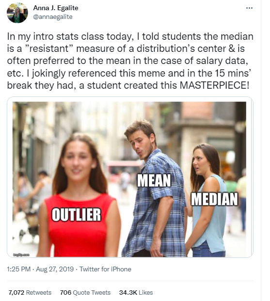

```{r setup, include = FALSE}
options(htmltools.dir.version = FALSE)

knitr::opts_chunk$set(warning = FALSE,
                      message = FALSE,
                      fig.align = "center",
                      fig.height = 3)

if (!require(pacman)) install.packages('pacman', repos = 'https://cran.rstudio.com')
pacman::p_load(tidyverse, here, knitr, dplyr, ggplot2, blogdown, rio, gridExtra, xaringanthemer)

extra_css <- list(
  ".red"   = list(color = "red"),
  ".blue"  =list(color = "blue"),
  ".red-pink" = list(color= "#e64173"),
  ".grey-light" = list(color= "#dbd7d8"),
  ".purple" = list(color = "purple"),
  ".large" = list("font-size" = "120%"),
  ".small" = list("font-size" = "90%"),
  ".tiny" = list("font-size" = "70%"),
  ".tiny2" = list("font-size" = "50%"))

write_extra_css(css = extra_css, outfile = "my_custom.css")
```

```{r, echo = F}
 getmode <- function(v) {
   uniqv <- unique(v)
   uniqv[which.max(tabulate(match(v, uniqv)))]
}

```

# Roadmap

```{r, out.width = "90%", echo=F}
  
```

---
# Class goals

.large[
- Describe and summarize quantitative data that are continuous
- Describe the purpose and compute the following measures of central tendency: mean, median and mode
- Describe the purpose and compute the following measures of variability: quartiles, inter-quartile range, range, variance and standard deviation
  + Describe conceptually the principles of skewness and kurtosis
- Create visualizations of quantitative data that are continuous using R
  + Includes constructing and interpreting histograms, densities, stem-and-leaf, and box-and-whisker plots
]

---
# Life expectancy data
Suppose you are working for the World Health Organization and are investigating life expectancy across different regions. 

> Using this dataset, we can ask questions like:
> * How does life expectancy compare in high-income vs. middle- and low-income countries?
> * Do individuals living in countries with more total years of attendance in school experience, on average, higher life expectancy?


--
.red[**Note this question is framed in an implicitly causal way, but we are not able to answer that. This analysis is purely for educational purposes. Do NOT attempt at home!!!**] We now return you to your originally scheduled programming...

--

Before making comparisons between social/economic conditions, we want to start with describing our data, looking at all 183 nations in the dataset.

**Our first task:** Describe the distribution of regional life expectancy in 2015.

---
# Materials

### 1. Life expectancy data (in file called life_expectancy.csv)
### 2. Codebook describing the contents of said data
### 3. R script to conduct the data analytic tasks of the unit

---
# Read in life expectancy

```{r, echo=T}
who <- read.csv(here("data/life_expectancy.csv")) %>%
  
  # going to do some data cleaning; 
  # first making variable names take a common format
  janitor::clean_names() %>% 
  
  # filtering to focus only on 2015
  filter(year == 2015) %>%
  
  # selecting only the variables we need
  select(country, status, life_expectancy, schooling) %>% 
  
  # renaming one of the variables
  rename(region = country) %>% 
  
  # rounding life expectancy to nearest year
  mutate(life_expectancy = round(life_expectancy, digits = 0))

```


.red[**You do not need to learn how to do this; just a demonstration!**]

---
class: middle, inverse
# Distributions

---
# Describing a Distribution

There are many ways to describe the characteristics of a .blue[**distribution**]. 

**In these classes, we are reviewing:**
* What is a distribution?

* Measures of Central Tendency
  + Mean
  + Median
  + Mode
  
* Spread or Variability
  + Variance
  + Standard Deviation
  + Interquartile Range
  + Range

* Measures of Skewness
* Measures of Kurtosis

---
# What is a distribution?

A distribution describes the number of observations of variable that take a particular value.

```{r, echo = F, fig.height = 6, fig.width = 10, dpi = 600}
set.seed(200)

world <- map_data("world")

who1<- unique(who$region)
world1 <- unique(world$region)

d <- who %>% 
      filter(str_length(region) <= 8) %>% 
      sample_n(60)

d_hist <- hist(d$life_expectancy, plot = FALSE)

d$x_bin <- cut(d$life_expectancy, 
               breaks = d_hist$breaks,
               label = FALSE)

d$x_mid <- d_hist$mids[d$x_bin]
d$y <- 1

d <- d %>% 
  group_by(x_bin) %>% 
  mutate(y = cumsum(y))

country_plot <- ggplot() +
  geom_label(data = d, 
             aes(x = x_mid,
                 y = y,
                 label = region),
             size = 4) +
  theme_bw(base_size = 12) +
  theme(panel.grid = element_blank()) +
  labs(x = "Average Life Expectancy", y = "Count")

country_plot
```
---
## Visualizing distributions: Histogram

+ Groups the data into "bins" and shows the count of observations in each bin
+ Can specify number of bins/bin width

```{r, echo=T, fig.height=3.5}
hist(who$life_expectancy)
```


--

.blue[*What can you already say about the shape of this distribution?*]

---
## Visualizing distributions: Histogram

+ Groups the data into "bins" and shows the count of observations in each bin
+ Can specify number of bins/bin width

```{r, echo=T, fig.height=3.5}
hist(who$life_expectancy, breaks = 16)
```


.blue[*What can you already say about the shape of this distribution?*]

---
## Visualizing distributions: Histogram

+ Groups the data into "bins" and shows the count of observations in each bin
+ Can specify number of bins/bin width

```{r, echo=T, fig.height=3.5}
ggplot(who, aes(life_expectancy)) + geom_histogram()
```


.blue[*What can you already say about the shape of this distribution?*]

---
## Visualizing distributions: Histogram


+ Groups the data into "bins" and shows the count of observations in each bin
+ Can specify number of bins/bin width

.pull-left[
**Histogram**
```{r, echo=F}
ggplot(who, aes(life_expectancy)) + geom_histogram()
```
]

.pull-right[
**Bar plot**
```{r, echo=F}
ggplot(who, aes(life_expectancy)) +
  geom_bar()
```
]

.blue[*What is the difference between the two plots?*]


---
## Visualizing distributions: Stem-and-leaf

- The "leaf" represents the last digit of a number (typically the 1s place, unless data need to be rounded to the nearest ten)
- The "stem" contains all other digits of number and serves as a grouping category for observations

---
```{r}
stem(who$life_expectancy)
```

---
## Visualizing distributions: Density
  
- Can think of this as a "smoothed out" histogram
- Values reflect the distribution's probability density function (not essential to understand their calculation)
  
```{r}
ggplot(who, aes(life_expectancy)) +
  geom_density()

```

* Any point on the curve records the probability that you would observe that value of the variable by randomly drawing one observation from your sample

---
class: middle, inverse
# Measures of central tendency

---
# Mean
* Represents the **average**, or the sum of all observations divided by the number of observations.
* One of the most common forms of central tendency.

 
> $$mean(71, 73, 76, 78, 79) = \frac{71 + 73 + 76 + 78 + 79}{5} = 75.4$$


Writing this out can be a little tedious. Since our datasets can often have hundreds, thousands or millions of observations, we often use **summation notation**.
---
# Summation notation

Summation (or sigma) notation is used to provide a concise expression for the sum of observations.

$$\sum_{i=i}^{n} x_{i}$$
* i = index of summation (the unit that the observations are in; e.g., schools, students, numbers)
* n = stopping point (number of observations)
* $x_i$ = summation element (what we are summing)

Our mean formula rewritten using summation notation:


$$\bar{X} = \frac{1}{n}{\sum_{i=i}^{n} X_{i}}$$
--

We use the bar on the X $(\bar{X})$ to indicate that we are calculating the mean value of the variable.

---
# Summation notation

Let's demonstrate using our WHO data of 183 countries to find the mean.

> $$\bar{X} = \frac{1}{183}{\sum_{i=1}^{183} X_{i}} = \frac{13110}{183} = 71.64$$

The mean national life expectancy for these countries in 2015 is 71.64 years.

> **Reminder**:

> $i$ = index of summation (the unit that the observations are in; e.g., schools, students, numbers)

> $n$ = stopping point (number of observations)

> $x_i$ = summation element (what we are summing)

--

While this isn't critical to understand right now, the reason we index the summation $i$ through $n$ is that we could, in principle, want to summarize only the first 6 countries. Or the 5th through 24th countries. We would write the latter as: 

$$\bar{X} = \frac{1}{20}{\sum_{i=5}^{24} X_{i}}$$

---
# Mean
* The mean can take a value not found in the data.

* The mean represents the "balance point" or "fulcrum" of the distribution.

* Deviations from the mean sum to 0.

* Outliers, or observations with highly unusual values, can affect this balance point.

* Thus, the mean is vulnerable to outliers.

* Can only be used with interval- and ratio-level variables.

---
# Vulnerability of the mean
.small[
* Humans on Mars and Venus have very low life expectancies (for now).
* Here, having Mars and Venus in this sample of countries greatly shifts our mean away from the "peak" of the distribution and from the mean of the distribution, excluding these two outliers.
]

```{r, echo = F, fig.height=5.5, fig.width=10, dpi = 600}
ggplot() +
  geom_label(data = d, 
             aes(x = x_mid,
                 y = y,
                 label = region),
             size = 3) +
  theme_bw(base_size = 12) +
  theme(panel.grid = element_blank()) +
  labs(x = "Average Life Expectancy", y = "Count") +
  geom_label(aes(x = 2, y = 1, label = "Mars"), fill = "red", size = 3) +
  geom_label(aes(x = 2, y = 2, label = "Venus"), fill = "red", size = 3) +
  geom_vline(xintercept = mean(d$life_expectancy)) +
  geom_vline(xintercept = ((sum(d$life_expectancy) + 2 + 2)/62), color = "red")
```

---
# Median
* Represents the **midpoint** of the distribution.

* Also called the *50th percentile* of a distribution or *2nd quartile*, meaning half of the observations are above the median and half are below.

* Particularly useful for describing the central tendency of skewed distributions (more on this later).

* Can be used with ordinal-, interval-, or ratio-level variables.

* To find the median, arrange the scores in ascending order and identify the middle value. If there are two middle values (i.e., an even number of observations), use the average of the two.

> $$median(71, 73, 76, 78, 79) = 76$$
> $$median(71, 73, 76, 77, 78, 79) = 76.5$$

---
# Median
* Unlike the mean, the median is less affected by outliers.

```{r, echo = F, fig.height=5.5, fig.width=10, dpi = 600}
d_med <- d %>% 
  ungroup() %>% 
  add_row(region = "Mars", life_expectancy = 2) %>% 
  add_row(region = "Venus", life_expectancy = 2)

ggplot() +
  geom_label(data = d, 
             aes(x = x_mid,
                 y = y,
                 label = region),
             size = 3) +
  theme_bw(base_size = 12) +
  theme(panel.grid = element_blank()) +
  labs(x = "Average Life Expectancy", y = "Count") +
  geom_label(aes(x = 2, y = 1, label = "Mars"), fill = "red", size = 3) +
  geom_label(aes(x = 2, y = 2, label = "Venus"), fill = "red", size = 3) +
  geom_vline(xintercept = median(d$life_expectancy)) +
  geom_vline(xintercept = median(d_med$life_expectancy), color = "red")
```

---
### With apologies for reifying gender stereotypes:

--

```{r, echo=F, out.height="530px", out.width="490"}

```

---
# Mode
The mode simply refers to the **most frequent value** in the data.

What is the mode of the following data?

> 78, 79, 78, 77, 80, 79, 76, 74, 79, 78, 77, 78, 80, 79, 78, 76, 79, 77, 78, 78

It's easier if we sort the data first.

> 74, 76, 76, 77, 77, 77, **78, 78, 78, 78, 78, 78, 78,** 79, 79, 79, 79, 79, 80, 80

78 is the most frequent value in the data. Therefore, the mode is 78.

---
# Mode

Sometimes there may be more than one mode. Consider the following example:

> 4, 6, 6, 7, 7, 7, **8, 8, 8, 8, 8, 8, 8, 9, 9, 9, 9, 9, 9, 9,** 10, 10

Both 8 and 9 are observed seven times. In this case, the data can be considered **bimodal** and both modes would be reported.

In general, the mode--as a single statistic--is rarely used and is particularly vulnerable to idiosyncratic patterns in the data. However, the concept can be helpful in describing the overall shape of a distribution.

---
# Implementing in R

```{r, echo=T}
mean(who$life_expectancy, na.rm = T)

## If there are missing values of life_expectancy (NA), we will get
## an error. So, we generally want to set na.rm = T which tells R 
## to ignore missing values. (By default na.rm = F)

## Are there any missing? No!
sum(is.na(who$life_expectancy))

median(who$life_expectancy)

```

--

Base R does not have an easy way of calculating the mode. There are some work-arounds, but we won't cover them in this class. Importantly `mode` does something altogether different.

---
# Comparing distributions

These distributions have the same central tendency (mean = 100).

.blue[How are they different?]

```{r, echo = F}
narrow <- tibble(values = rnorm(10000, mean = 100, sd = 1)) %>% 
  ggplot(aes(values)) +
  geom_density(adjust = 3) +
  theme_classic() +
  geom_vline(xintercept = 100, color = "red")

wide <- tibble(values = rnorm(10000, mean = 100, sd = 10)) %>% 
  ggplot(aes(values)) +
  geom_density(adjust = 3) +
  theme_classic() +
  geom_vline(xintercept = 100, color = "red")

gridExtra::grid.arrange(narrow, wide, nrow = 1)
```

--
```{r, echo=F}
narrow2 <- tibble(values = rnorm(10000, mean = 100, sd = 1)) %>% 
  ggplot(aes(values)) +
  geom_density(adjust = 3) +
  xlim(60,140) +
  theme_classic() +
  geom_vline(xintercept = 100, color = "red")
gridExtra::grid.arrange(narrow2, wide, nrow = 1)
```

---
class: middle, inverse
# Measures of variability

---
# Variability

* Central tendency is only one component of a distribution.

* What if we want to know how much variation there is in life expectancy across nations?
  + How much does the typical observation deviate from the mean?

* **Measures of Variability:**
  + Range
  + Interquartile Range
  + Variance
  + Standard Deviation

---
# Range

* Represents the difference between the highest value and lowest value in the dataset.
* Can provide a rough estimate of spread

> $$range(71, 73, 76, 78, 79) = 79 - 71 = 8$$

* Very vulnerable to outliers. One observation can make a big difference!

> $$range(55, 73, 76, 78, 79) = 79 - 55 = 24$$

---
# Interquartile Range (IQR)
* Represents the difference between the 1st quartile (25th percentile) and the 3rd quartile (75th percentile).

* **Percentile** refers to the percentage of observations that fall at or below that score.
  + e.g., 25% of observed national life expectancies fall at or below 66 years of age.

* IQR summarizes the range of "average" scores in the dataset.

```{r, echo = F}
ggplot(who, aes(x = life_expectancy)) +
  geom_density() +
  geom_vline(xintercept = quantile(who$life_expectancy, .25)) +
  geom_label(
    x = quantile(who$life_expectancy, .25),
    y = .03,
    label = paste("25th %ile =", quantile(who$life_expectancy, .25))
  ) +
  geom_vline(xintercept = quantile(who$life_expectancy, .75)) +
  geom_label(
    x = quantile(who$life_expectancy, .75),
    y = .03,
    label = paste("75th %ile =", quantile(who$life_expectancy, .75))
  ) +
  geom_segment(
    x = quantile(who$life_expectancy, .25),
    xend = quantile(who$life_expectancy, .75),
    y = .015,
    yend = .015,
    linetype = 2
  ) +
  geom_label(x = 71.5,
             y = 0.01,
             label = "IQR = 11") +
  theme_classic()
  
```
---
# Implementing in R

```{r, echo=T}

range(who$life_expectancy)

IQR(who$life_expectancy)

quantile(who$life_expectancy)

# By default will give quartiles
# Can change with probs sub-command
```

---
# Variance
* Represents the **average squared deviation** (let's call this $s^{2}$) of each observation from the mean.<sup>1</sup>

$$s^{2} = \frac{\Sigma_{i=1}^n(x_i-\bar{x})^2}{N}$$

* .blue[*Why do we square the deviation?*]


.footnote[[1] This is actually not quite right. When calculating a sample statistic of the variance or standard deviation, the denominator in the above equation is actually *N*-1. We will learn why when we get to *degrees of freedom* in the next unit.]

--

Let's unpack what this equation does...

---
# Variance
Here are some national life expectancies centered around the mean. Their value represents their difference relative to the sample mean.
  
```{r, echo = F, fig.height = 5, fig.width = 8}
who$life_cnt <- round((who$life_expectancy - mean(who$life_expectancy)))
who$life_type <- ifelse(who$life_cnt < 0, "below", "above")
who$region <- as.factor(who$region)

set.seed(154)
var_plot <- who %>%
  sample_frac(.10) %>% 
  arrange(life_cnt) %>% 
  ggplot(aes(x=reorder(region, desc(life_cnt)), y=life_cnt, label=life_cnt)) +
geom_bar(stat='identity', aes(fill=life_type), width=.5) +
scale_fill_manual(name="Life Expectancy (deviation)",
labels = c("Above Average", "Below Average"),
values = c("above"="#00ba38", "below"="#0b8fd3")) +
labs(subtitle="Mean-centered life expectancy for random subset of nations") +
  coord_flip() +
  theme_minimal()

var_plot
```
Some observations fall below the mean so their deviation is a negative value. If we took the average of our positive and negative deviations, we'd just get zero!

---
# Variance
Since any number squared is positive, let's try squaring our deviations.

```{r, echo = F, fig.height = 5, fig.width = 8}
who$life_cnt_sq <- round((who$life_expectancy - mean(who$life_expectancy))^2)

set.seed(154)
var_plot_sq <- who %>% 
  sample_frac(.10) %>% 
  arrange(life_cnt) %>% 
  ggplot(aes(x=reorder(region, desc(life_cnt)), y=life_cnt_sq, label=life_cnt)) +
geom_bar(stat='identity', aes(fill=life_type), width=.5) +
scale_fill_manual(name="Life Expectancy (deviation)",
labels = c("Above Average", "Below Average"),
values = c("above"="#00ba38", "below"="#0b8fd3")) +
labs(subtitle="Mean-centered life expectancy (squared) for random subset of nations") +
  theme_minimal() +
  coord_flip()

var_plot_sq
```
Now we can take the average of our squared deviations and get a non-zero value!
---
# Variance

Our variance (or average squared deviation) is approximately 66.43.

```{r, echo = F, fig.height = 5, fig.width = 8}
var_plot_sq +
  geom_hline(yintercept = mean(who$life_cnt_sq), color = "red")
```

By itself, a variance of 66.43 is not very meaningful to us. It does not reflect the raw units of our original scale (it represents squared units).
---
# Standard deviation

* If we take the square root of our sample variance, we can summarize average deviations back on our raw scale. 

* The standard deviation represents the **positive square root of the variance**.
Standard deviation = $$ s = \sqrt{s^2} $$
Standard deviation = $$ \sqrt{66.43} = 8.15 $$

The standard deviation of life expectancy in 2015 was approximately 8.15 *years*.

---
# Standard deviation

Here is our original plot with our .blue[standard deviation (*SD*)] plotted below and above the mean (i.e., -1 *SD*, +1 *SD*).

```{r, echo = F, fig.height = 5, fig.width = 8}
var_plot +
  geom_hline(yintercept = 8.15, color = "red", linetype = 2) +
  geom_hline(yintercept = -8.15, color = "red", linetype = 2)
```

The standard deviation of life expectancy in 2015 was approximately 8.15 *years*.

---
# Implementing in R

```{r, echo=T}

# Variance
var(who$life_expectancy)

# Standard deviation
sd(who$life_expectancy)

```

---
# You try

Given the following set of observed value (75, 74, 66, 78, 73, 78), calculate the:
* Mean
* Median
* Mode
* Range
* Variance
* Standard deviation

---
# Statistical notation

Statistics usually have two notational forms:
* Population statistics (Greek alphabet) - Hypothetical values in the full universe of all possible values
* Sample statistics (Roman alphabet) - Actual values in our research sample

.pull-left[
Sample Statistics - Roman Alphabet
* Mean - $\bar{x}$
* Standard Deviation - $s$
* Variance - $s^2$
]

.pull-right[
Population Statistics - Greek Alphabet
* Mean - $\mu$
* Standard Deviation - $\sigma$
* Variance - $\sigma^2$
]

---
# Statistical notation
Often times we use sample statistics to **estimate** population statistics. 

An estimated value is denoted with a "hat."

.pull-left[
Sample Statistics $\rightarrow$ Population Estimates
* Mean - $\bar{x} \rightarrow \boldsymbol{\hat{\mu}}$
* Standard Deviation - $s \rightarrow \boldsymbol{\hat{\sigma}}$
* Variance - $s^2 \rightarrow \boldsymbol{\hat{\sigma}^2}$
]

.pull-right[
Population Statistics - Greek Alphabet
* Mean - $\mu$
* Standard Deviation - $\sigma$
* Variance - $\sigma^2$
]

--

<br>

*These Greek letters are conventions that statisticians have used over the years. There are many other of these notational conventions (for example, when to use capital- or lower-case Greek letters). There's no inherent reason why they are used (e.g., you could use $\psi$ to represent the mean), but we tend to use the conventional symbols to reduce cognitive load. You'll want to get familiar with some of the most commonly used ones yourself.*

---
# Distributional shape: Skewness
* Not all distributions in the real world are symmetrical. Often they have asymmetry or **skewness**.
* Skewness describes how much a distribution is "bunched up" to the right or left.

```{r, echo = F}
set.seed(1000)
 N <- 10000
 x <- tibble(pos_skew = rbeta(10000, 1.5 ,5),
                 neg_skew = rbeta(10000, 5, 1.5),
                 central = rbeta(10000, 5 , 5)) %>% 
     mutate(across(everything()), round(., digits = 2))
 
pos_skew <- ggplot(x, aes(pos_skew)) +
  geom_density(adjust = 4) +
  xlim(0, 1) + 
  ylim(0, 2.5) +
  ggtitle("Positive Skew") +
  theme_classic() +
  theme(axis.title = element_blank())

neg_skew <- ggplot(x, aes(neg_skew)) +
  geom_density(adjust = 4) +
  xlim(0, 1) + 
  ylim(0, 2.5) +
  ggtitle("Negative Skew") +
  theme_classic() +
  theme(axis.title = element_blank())

normal <- ggplot(x, aes(central)) +
  geom_density(adjust = 2) +
  xlim(0, 1) + 
  ylim(0, 2.5) +
  ggtitle("No Skew") +
  theme_classic() +
  theme(axis.title = element_blank())

gridExtra::grid.arrange(pos_skew, normal, neg_skew, nrow = 1)
```

* .red[**Positive Skew**] - Distribution is skewed to the right with a "positive-pointing finger."
* .red[**Negative Skew**] - Distribution is skewed to the left with a "negative-pointing finger."

---
# Distributional shape: Kurtosis

* .red[**Kurtosis**] describes how much the values concentrate around the center (the "pointiness" of a distribution)
 + .red[Leptokurtic] distributions have more values around the center and have a "taller" peak.
 + .red[Platykurtic] distributions do not have a prominent peak and have a flatter top.
 
 
```{r, echo = F}
# Fleischmann coeffiecients to generate a distribution with kurtosis = 4
a <- 0
b <- 0.7373813
c <- 0
d <- 0.08092509

# Fleischmann coeffiecients to generate a distribution with kurtosis = -1
e <- 0
f <- 1.221009
g <- 0
h <- -0.08015816

k <- tibble(central = rnorm(10000, 0, 1)) %>% 
  mutate(lepto = a + b*central + c*(central^2) + d*(central^3),
         platy = e + f*central + g*(central^2) + h*(central^3))
         

platy <- ggplot(k, aes(platy)) +
  geom_density(adjust = 4) +
  xlim(-3, 3) +
  ylim(0, .5) +
  theme_classic() +
  theme(axis.title = element_blank()) +
  ggtitle("Platykurtic")

lepto <- ggplot(k, aes(lepto)) +
  geom_density(adjust = 4) +
  xlim(-3, 3) +
  ylim(0, .5) +
  theme_classic() +
  theme(axis.title = element_blank()) +
  ggtitle("Leptokurtic")

central <- ggplot(k, aes(central)) +
  geom_density(adjust = 4) +
  xlim(-3, 3) +
  ylim(0, .5) +
  theme_classic() +
  theme(axis.title = element_blank()) +
  ggtitle("Mesokurtic (No Kurtosis)")


gridExtra::grid.arrange(platy, central, lepto, nrow = 1)

```
---
# Moments of a distribution
Each of these statistics we've covered describe a different .red["moment of a distribution."]

1. Mean
$$\mu = \frac{\Sigma(x_i)}{N}$$
2. Variance
$$\sigma^2 = \frac{\Sigma(X_i-\mu)^2}{N}$$
3. Skewness
$$\color{lightgray}{ skewness(X) = \frac{1}{N\sigma^3}\Sigma(X_i-\mu)^3}$$
4. Kurtosis
$$\color{lightgray}{ kurtosis(X) = \frac{1}{N\sigma^4}\Sigma(X_i-\mu)^4-3}$$


We do not need to know how to calculate skew and kurtosis but we do need to have a sense of how to interpret them.

---
# Evaluating Skewness and Kurtosis

* Skewness and kurtosis can be evaluated visually and summarized quantitatively.

  + Positive skew (skewed to the right) $\rightarrow$ Skewness > 0
  + Negative skew (skewed to the left) $\rightarrow$ Skewness < 0

  + Leptokurtic $\rightarrow$ Kurtosis > 0
  + Platykurtic $\rightarrow$ Kurtosis < 0
  

Note: In this course we will focus visual analysis for severe skew or kurtosis. Future courses will discuss how to correct for skew or kurtosis, as necessary. 

---
# Summarizing data

* Here is a density plot of the WHO life expectancy data for 2015. 
* How would you characterize the distribution?

```{r, echo = F}
ggplot(who, aes(life_expectancy)) +
  geom_density() +
  theme_minimal()
```

* .blue[What kind of skew does this distribution have?]

--

* .blue[Is there severe skew?]
* .blue[Is there severe kurtosis?]

---
# Summarizing Data

The distribution of life expectancy has a slightly negative skew and no excess kurtosis. The skewness and kurtosis are not severe.
```{r, echo = F}
ggplot(who, aes(life_expectancy)) +
  geom_density() +
  geom_vline(xintercept = mean(who$life_expectancy), color = "red") +
  geom_vline(xintercept = median(who$life_expectancy), color = "blue") +
  theme_minimal()
```


The .red[mean] national life expectancy in 2015 was **71.62** years.

The .blue[median] national life expectancy in 2015 was **74** years.

* Due to the slight skew, the median appears to better capture the "center" of our distribution.

---
# Other distribution visualizations

Although histograms and density plots are useful for evaluating the shape of a distribution, they do not efficiently summarize the central tendency and variance.

### Box-and-whisker plot (aka "boxplot")
* Provides five helpful numbers of a distribution
  - Q1, Q2 (Median), Q3
  - Lower Fence (Q1 - 1.5*IQR)
  - Upper Fence (Q3 + 1.5*IQR)

Here is a sample boxplot of our WHO data overlain on a density plot.

```{r, echo = F, fig.width = 6, fig.height = 3.75}

p <- ggplot() +
  geom_density(data=who, 
               aes(x=life_expectancy),
               alpha=.3) +
  theme(axis.title.y=element_blank(), 
        axis.text.y=element_blank()) +
  xlim(40,100)

dpb <- ggplot_build(p)

q1 <- min(which(dpb$data[[1]]$x >= 66))
q3 <- max(which(dpb$data[[1]]$x <= 77))
lf <- min(which(dpb$data[[1]]$x >= 51))
uf <- max(which(dpb$data[[1]]$x <= 88))


line_label <- function(xint, yint, lbl, clr) {
    list(
      geom_segment(aes(x = xint, xend = xint, y = 0, yend = .1), color = clr, linetype = 2),
      geom_label(aes(x = xint, y = yint), label = lbl, color = clr)
    )
}

p +
  geom_area(data=data.frame(x=dpb$data[[1]]$x[q1:q3],
                       y=dpb$data[[1]]$y[q1:q3]),
            aes(x=x, y=y), fill="purple", alpha = .5) +
    geom_area(data=data.frame(x=dpb$data[[1]]$x[lf:q1],
                       y=dpb$data[[1]]$y[lf:q1]),
            aes(x=x, y=y), fill="cornflowerblue", alpha = .5) +
      geom_area(data=data.frame(x=dpb$data[[1]]$x[q3:uf],
                       y=dpb$data[[1]]$y[q3:uf]),
            aes(x=x, y=y), fill="cornflowerblue", alpha = .5) +
    geom_boxplot(data=who, 
               aes(x=life_expectancy, y = 0.1),
               alpha=.5,
               fill = "purple", width = 0.05) +
  line_label(xint = 74, clr = "black", yint = .1, lbl = "Median") +
  line_label(xint = 66, clr = "blue", yint = .085, lbl = "Q1") +
  line_label(xint = 77, clr = "blue", yint = .085, lbl = "Q3") +
  line_label(xint = 51, clr = "forestgreen", yint = .07, lbl = "Q1 - 1.5*IQR") +
  line_label(xint = 88, clr = "forestgreen", yint = .07, lbl = "Q3 + 1.5*IQR") +
  theme_minimal()

```

---
# Boxplots

A basic boxplot can quickly capture the median, the interquartile range and any outlying values (we don't have any of these in our data).

```{r, fig.height=5}
boxplot(who$life_expectancy, horizontal=T)
```

---
# Boxplots

However, we frequently visualize distributions across several groups for comparison.

```{r, fig.height=3.5, fig.width=6, echo = F}
who_more <- import(here::here("data", "life_expectancy.csv")) %>% 
  janitor::clean_names() %>% 
  filter(year >= 2010 & year <= 2015) %>% 
  select(country, status, year, life_expectancy) %>% 
  rename(region = country) %>% 
  mutate(life_expectancy = round(life_expectancy, digits = 0))
```

```{r, fig.height=3.5, fig.width=6, echo = T}
ggplot(data = who_more, aes(factor(year), life_expectancy, 
                            fill = factor(year))) +
  geom_boxplot() +
  theme_minimal() + theme(legend.position = "none")
```


--

> It appears the life expectancy of Q1 increases more each year than the median or Q3. Thus, we might hypothesize that lower-life-expectancy countries made bigger gains from 2010-2015 than countries with higher-than-average life expectancies. **But more exploration would be needed to confirm this!**


---
# Summing up

So we have characterized some features of the average national life expectancy among countries in the WHO database. However, we are still interested in asking more complex questions such as:

> * How does life expectancy compare in high- vs. middle- and low-income countries?
> * Do individuals living in countries with more total years of attendance in school experience, on average, higher life expectancy?

--

#### .purple[**That is where we will turn to in the next unit! But first, we need to learn more about how to transform distributions and make statistical inferences!**]

---
class: middle, inverse
# Synthesis and wrap-up

---
# Class goals

.large[
- Describe and summarize quantitative data that are continuous
- Describe the purpose and compute the following measures of central tendency: mean, median and mode
- Describe the purpose and compute the following measures of variability: quartiles, inter-quartile range, range, variance and standard deviation
  + Describe conceptually the principles of skewness and kurtosis
- Create visualizations of quantitative data that are continuous using R
  + Includes constructing histograms, densities, stem-and-leaf, and box-and-whisker plots
]

---
# To Dos

### Reading
- LSWR Chapter 5: descriptive statistics
- Hu (2021)

### Optional follow-up
- Complete Module 8 (dataframes) in R Bootcamp
- Complete Module 10 (data management) in R Bootcamp

### Assignments
- Assignment #3 due November 7, 11:59pm