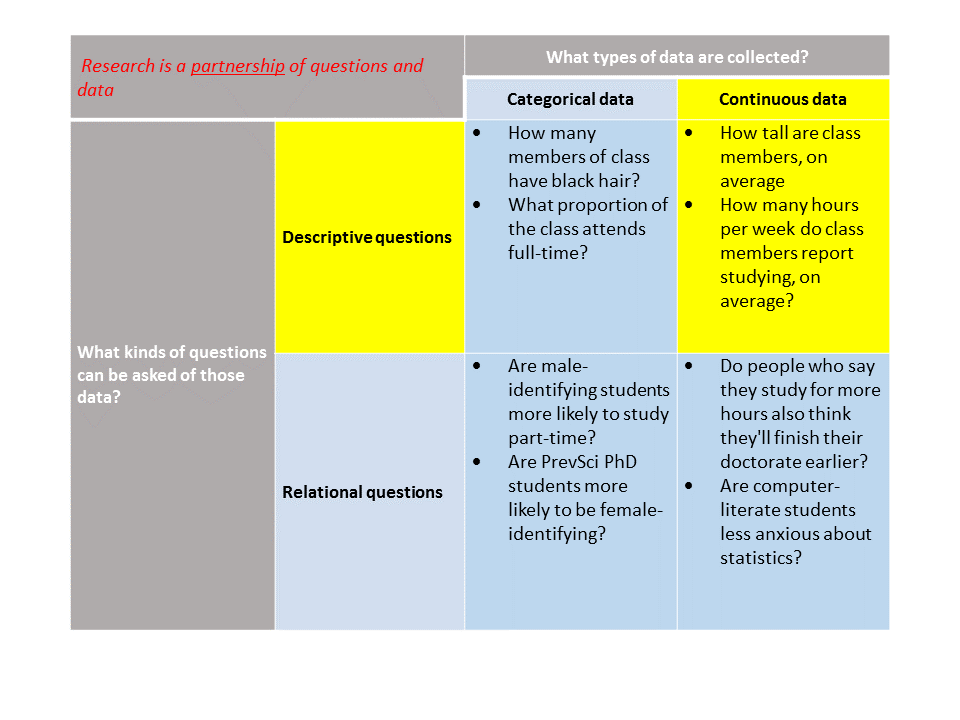

```{r setup, include = FALSE}
options(htmltools.dir.version = FALSE)

knitr::opts_chunk$set(warning = FALSE,
                      message = FALSE,
                      fig.align = "center",
                      fig.height = 3)

if (!require(pacman)) install.packages('pacman', repos = 'https://cran.rstudio.com')
pacman::p_load(tidyverse, here, knitr, dplyr, ggplot2, blogdown, rio, gridExtra, xaringanthemer)

extra_css <- list(
  ".red"   = list(color = "red"),
  ".blue"  =list(color = "blue"),
  ".red-pink" = list(color= "#e64173"),
  ".grey-light" = list(color= "#dbd7d8"),
  ".purple" = list(color = "purple"),
  ".large" = list("font-size" = "120%"),
  ".small" = list("font-size" = "90%"),
  ".tiny" = list("font-size" = "70%"),
  ".tiny2" = list("font-size" = "50%"))

write_extra_css(css = extra_css, outfile = "my_custom.css")
```

```{r, echo = F}
 getmode <- function(v) {
   uniqv <- unique(v)
   uniqv[which.max(tabulate(match(v, uniqv)))]
}

```

# Roadmap

```{r, out.width = "90%", echo=F}
  
```

---
# Class goals

.large[
- Construct a standardized or $z$-score and explain its substantive meaning
- Use a $z$-transformation to compare distributions, observations within distributions and interpret outlying values
- Be prepared for future use of $z$-transformations in analysis
]

---
# A "standard" deviation

The standard deviation (s) represents the **positive square root of the variance**.<sup>1</sup>

$$s = \sqrt{\frac{\Sigma_{i=1}^n(x_i-\bar{x})^2}{N}}$$

.footnote[[1] This is actually not quite right. When calculating a sample statistic of the variance or standard deviation, the denominator in the above equation is actually *N*-1. We will learn why when we get to *degrees of freedom* in the next unit.]


--

**Steps:**
1. Subtract the mean from each observation in your data (this number is the deviation from the mean)
2. Square each resulting difference
3. Add up all of the squared deviations
4. Divide by the total number of observations
5. Take the square root $\rightarrow$ standard deviation

---
# A common metric
* .small[A distribution can have any mean and any (positive) standard deviation.]


```{r, echo = F, fig.height=2.75}
trans_samp <- tibble(d1 = rnorm(1000, mean = 54, sd = 7),
                     d2 = rnorm(1000, mean = 850, sd = 100)) %>% 
  mutate(d1_t = (d1-mean(d1))/sd(d1),
         d2_t = (d2-mean(d2))/sd(d2))

d1_plot <- ggplot(trans_samp, aes(x = d1)) +
  geom_histogram() +
  ggtitle("Distribution 1")
d2_plot <- ggplot(trans_samp, aes(x = d2)) +
  geom_histogram() +
    ggtitle("Distribution 2")
d1_tplot <- ggplot(trans_samp, aes(x = d1_t)) +
  geom_histogram() +
  ggtitle("Distribution 1 - Transformed")
d2_tplot <- ggplot(trans_samp, aes(x = d2_t)) +
  geom_histogram() +
  ggtitle("Distribution 2 - Transformed")

grid.arrange(d1_plot, d2_plot, ncol=2, nrow =1)

```

--

* .small[Sometimes it is helpful to "standardize" a distribution to a common mean and standard deviation so we can more easily compare them (and understand outlying values).]

--

```{r, echo = F, fig.height=2.75}
grid.arrange(d1_tplot, d2_tplot, ncol=2, nrow =1)
```

---
# $Z$-transformations
* The most common transformation is a $z$-transformation. 
* A z-transformation re-scales the distribution to a mean $(\mu)$ of 0 and a standard deviation $(\sigma)$ of 1.


```{r echo=FALSE}
ggplot(data.frame(x = c(-4, 4)), aes(x = x)) +
  stat_function(fun = dnorm) +
  scale_x_continuous(limits = c(-4, 4),
                     breaks = c(seq(-4, 4, 1))) +
  ylim(0, 0.4) +
  theme_classic() +
  ggtitle("Standardized Distribution", subtitle =  "m = 0, sd = 1") +
  theme(plot.title = element_text(hjust = 0.5),
        plot.subtitle = element_text(hjust = 0.5))
```

---
# Z-transformations
* Any score and distribution can be standardized using a simple algorithm.

* Each observation $(i)$ is transformed into a **z-score** using the following formula:

$$z_{i} = \frac{x_{i} - \mu}{\sigma}$$

* A z-score is calculated by **subtracting the mean** from each value and **dividing by the standard deviation**.

* An observation's z-score value is equal to its distance from the mean, in standard deviation units.

--

* Some fun facts about z-scores
  + $\Sigma z_i = 0$
  + $\Sigma z_i^2 = N$

---
# Transformed distributions

Here is a histogram of our life expectancy data.
```{r, echo = F}
who <- read.csv(here("data/life_expectancy.csv")) %>%
  janitor::clean_names() %>% 
  filter(year == 2015) %>%
  select(country, status, life_expectancy, schooling) %>% 
  rename(region = country) %>% 
  mutate(life_expectancy = round(life_expectancy, digits = 0))

hist(who$life_expectancy)
```

We are going to create a new variable called `life_expectancy_zscore` using the formula described on the previous slide.
```{r, echo=T}
who$life_expectancy_zscore <- 
  (who$life_expectancy - mean(who$life_expectancy)) /
        sd(who$life_expectancy)
```

---
# The new distribution
```{r}
## Histogram of the new z-scores
hist(who$life_expectancy_zscore)
```

We now have a mean of 0 and standard deviation of 1.


---
# "Transforming" vs. "normalizing"

An important note about standardizing a distribution is that it changes the mean and standard deviation, but **does not change the overall shape.**

```{r, echo = F}
who_raw <- ggplot(who, aes(life_expectancy)) +
  geom_histogram(binwidth = 1)

who_stand <- ggplot(who, aes(life_expectancy_zscore)) +
  geom_histogram(binwidth = 0.125)

grid.arrange(who_raw, who_stand, ncol = 2, nrow = 1)

```


---
# You try

> Given the following set of observed value (75, 74, 66, 78, 73, 78), perform a $z$-transformation. What are the resulting $z$-scores?

---
# How has this helped?

So we started with the promise that "transforming" (or "standardizing") a distribution would help us to better understand the "distance" that a given observation is from the center of the distribution and that $z$-scores allow us to compare across units of measurement.

Let's say we are interested in the life expectancy in a particular country and how this compares to both the average life expectancy and the distribution of life expectancies. For convenience, say Canada:

```{r}
mean(subset(who$life_expectancy, 
            who$region == "Canada"))

mean(who$life_expectancy)
```

--
.blue[**How different is life expectancy in Canada compared to our sample average?**]

--

.blue[*Ok, but how different are these two numbers?*]

--
And how different is Canada from the life-expectancy sample mean as compared to its difference from countries' average years of schooling?

---
# How has this helped?

Life expectancy:
```{r}
mean(subset(who$life_expectancy, 
            who$region == "Canada"))

mean(who$life_expectancy)
```

--

Canadian schooling:
```{r, echo=F}
mean(subset(who$schooling, 
            who$region == "Canada"))
```
Average schooling:
```{r, echo=F}
mean(who$schooling, na.rm=T)
```

---
# Comparing on common metric

Now let's compare $z$-scores

```{r, echo=T}
mean(subset(who$life_expectancy_zscore, 
            who$region == "Canada"))
```

```{r, echo=F}
who <- who %>% mutate(schooling_zscore =
  (who$schooling - mean(who$schooling, na.rm=T)) /
        sd(who$schooling, na.rm=T))
```

```{r, echo=T}
mean(subset(who$schooling_zscore, 
            who$region == "Canada"))
```

--

.blue[**Is Canada more unusual with respect to its schooling or life expectancy?**]

---
# Comparing on common metric

```{r, echo=F, fig.height=4.5, fig.width=10}
expect_stand <- ggplot(who, aes(life_expectancy_zscore)) +
  geom_histogram(binwidth = 0.125) +
  geom_vline(xintercept = 1.271, color = "red", linetype = "dashed") +
  geom_vline(xintercept = 0, color = "blue", linetype = "dotdash") +
  annotate("text", label= c("Canada"), color = "red", x = 1.7, y = 14)

school_stand <- ggplot(who, aes(schooling_zscore)) + 
  geom_histogram(binwidth = 0.125) +
  geom_vline(xintercept = 1.158, color = "red", linetype = "dashed") +
  geom_vline(xintercept = 0, color = "blue", linetype = "dotdash") +
  annotate("text", label= c("Canada"), color = "red", x = 1.65, y = 10)

grid.arrange(expect_stand, school_stand, ncol = 2, nrow = 1)

```

---
# Outliers

.small[Compare the raw life expectancy to the standardized ones to get a better sense of outlying values:]

```{r, echo=T}
mean(who$life_expectancy, na.rm=T)

head(sort(who$life_expectancy))

tail(sort(who$life_expectancy))
```

--

.blue[Are these extreme values a lot or a little away from the mean, given the rest of the distribution?]

---
# Outliers
.small[Compare the raw life expectancy to the standardized ones to get a better sense of outlying values:]
```{r, echo=T}
head(sort(who$life_expectancy_zscore))
tail(sort(who$life_expectancy_zscore))
```

---
# Effect sizes

Careful<sup>1</sup> standardization of continuous variables will permit:
* Common understanding of any individual observation's distance from the center of the distribution, across variables
* Ease of identifying outlying values
* Ability to understand the standard normal distribution (next!)
* Conduct a $z$-test (next!)
* Calculation of magnitude of continuous relationships in a common metric known as the .blue[**effect size**]<sup>2</sup>


.footnote[[1] "Careful" because the distribution within which you standardize the variable has important implications for the transformation and the resulting analysis you will do. 

[2] *Further thoughts for those interested*: the .blue[**correlation coefficient**] is a standardized effect size which can be used communicate the strength of a relationship. We will examine the correlation coefficient and the related concept of .blue[**effect size**] further in EDUC 643 this winter.]


---
class: middle, inverse

# Mid-term SES results

### Response rate: 38 percent (11/29)

---
# Quantitative results

.pull-left[
**Generally positive:**
(>=70% rate as beneficial)
* Inclusivity
* Support from instructors
* Feedback provided
* Quality of course materials
* Communication
* Organization
* Relevance of content
* Assignments/projects
* Accessibility
]

.pull-right[
**Generally insufficient:**
(<70% rate as beneficial)
* Level of challenge
* Clarity of assignment instructions/grading
* Active learning
* Student interaction
]

--

There are diverging opinions within each of these categories, and so important to attend to ways in which these broad-stroke patterns are not true for all individuals.

---
# Qualitative results

.pull-left[
**Helpful:**
* Take feedback & adjust
* Explanation of concepts
* Feedback on how to improve
* Response to students' questions
* Generally supportive
* Readings and class website
]

.pull-right[
**Need improvement/suggestions:**
* Demeanor/expression in class
* 5 minutes to ask general questions
* Follow existing formats for learning R/more time learning R/more focus on R
* Clarity of quizzes
* More explicit/direct instruction
* Over-explanation of concepts $\rightarrow$ confusion
]

---
# Action steps

1. Time for stats/programming questions (as much as possible)
2. Practice explanation of concepts beforehand to improve clarity
3. Improve quiz structure
4. Increase opportunities for practice and student-student interaction

<br>


--

*Maintain primary focus of course on developing (applied) statistical and analytic toolkit with a secondary focus on application of these skills in the R programming language, following the syllabus as approved by your advisors and program directors via the College of Education curriculum Committee.*

---
class: middle, inverse
# Synthesis and wrap-up

---
# Class goals

.large[
- Construct a standardized or $z$-score and explain its substantive meaning
- Use a $z$-transformation to compare distributions, observations within distributions and interpret outlying values
- Be prepared for future use of $z$-transformations in analysis
]

---
# To Dos

### Quiz 3
- Opens 3:45pm on Oct. 27, closes at 5pm on Oct. 28

### Assignments
- Assignment #3 due November 7, 11:59pm