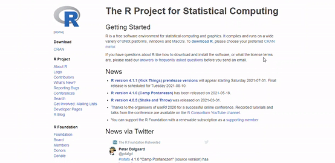

name: toc
<style type="text/css">
.remark-slide-content {
    font-family: font-family: 'Alegreya Sans', sans-serif;
    font-size: 24px;
    padding: 1em 2em 1em 2em;
}
</style>

```{r setup, include = FALSE}
knitr::opts_chunk$set(echo = TRUE)
```

# Table of Contents

1. [Terminologies](#term) 

2. [Instructions](#instr)

3. [Software Installation Demo](#demo)

4. [Hands-on Activity](#activity)

---
name: term
# Terminologies

 * [R](https://www.r-project.org/) is a free and open-source programming language, created by Ross Ihaka and Robert Gentleman at the University of Auckland, New Zealand.
 
 * [RStudio](https://www.rstudio.com/products/rstudio/#rstudio-desktop) is an integrated development environment (IDE) for R, serving as an interface to R.
 
  + It includes a console (a code editor that supports direct code execution) and numerous tools for plotting, history, debugging, and workspace management.
  
  + It has two versions: RStudio desktop (the software we'll be using in our computer) and RStudio server (RStudio access using a web browser)

---
name: instr
# Instructions

1. Download [R](https://www.r-project.org/) and install it in your computer

2. Download [RStudio Desktop](https://www.rstudio.com/products/rstudio/download/preview/) and install it in your computer

3. Get to know your RStudio; open RStudio on your desktop and practice with the hands-on activity

---
name: demo
# Installation Demo - R

Download R (then install it in your computer):

```{r, out.width = "85%", fig.align = "center", echo = FALSE}

```

---
# Installation Demo - RStudio

Download RStudio Desktop (then install it in your computer):

```{r, out.width = "85%", fig.align = "center", echo = FALSE}
knitr::include_graphics("./pics/download_rstudio.gif")
```

---
name: activity
# RStudio Hands-on Activity

Open your RStudio, run these below code in your console line-by-line for some practice working in R.

```{r, out.width = "50%", fig.align = "center", echo = FALSE}
knitr::include_graphics("./pics/console.png")
```

